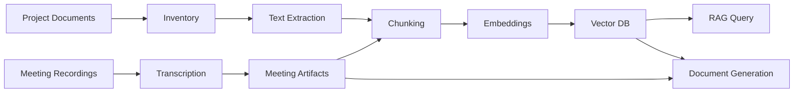

# Architecture

## High-Level Flow

## Components

- **Inventory**: discovers files and stores metadata.
- **Extraction**: converts documents into normalized text.
- **Chunking**: splits text into searchable units.
- **Embedding**: calls Ollama `bge-m3` with `num_ctx=8192`.
- **Vector Store**: stores searchable chunks in ChromaDB.
- **Meeting Processor**: transcribes and generates meeting artifacts.
- **Classifier**: assigns project stage, FTT, deliverable, task, and document relation.
- **Generator**: drafts project documents from retrieved evidence.
- **Watchdog**: monitors long-running build and recovers Ollama stalls.

## Runtime Invariants

- Embedding model name remains `bge-m3`.
- Every embedding request uses `options.num_ctx=8192`.
- Embedding cache is append-only during long builds.
- A live `03_build_index.py` process must not be killed by watchdog.
- Local runtime data is not committed to git.

## Storage Layers

- `data/manifest.jsonl`: discovered files.
- `data/extracted_text/`: extracted text cache.
- `data/chunks.jsonl`: current chunk set.
- `data/embeddings_cache.jsonl`: reusable embedding cache.
- `vector_db/`: ChromaDB persistent index.
- `logs/`: operational logs and markers.

