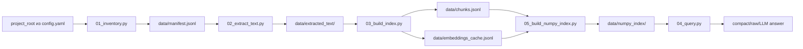
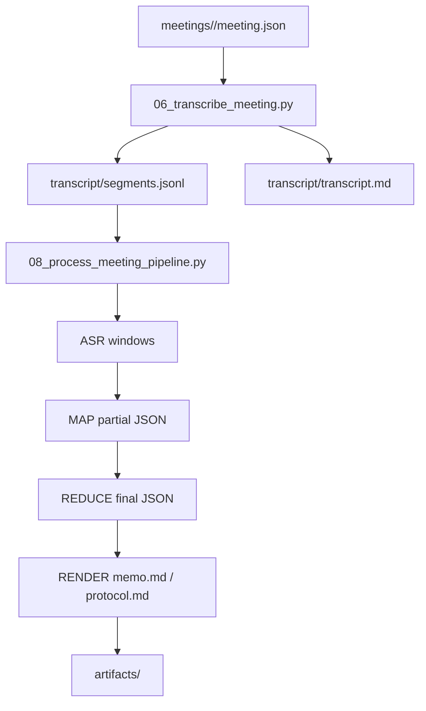
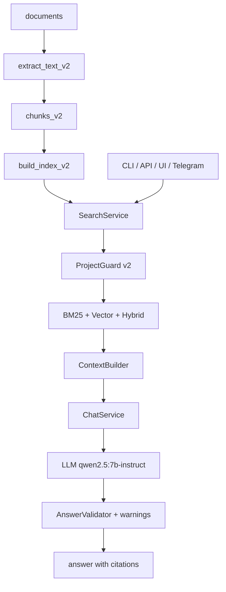
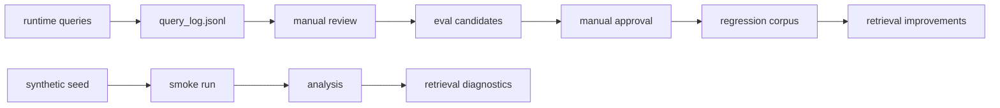

# Архитектура MeetingAgent

Обновлено: 2026-05-19.

## Назначение

MeetingAgent — локальный репозиторий проектной памяти. В нём сейчас живут четыре связанных, но разных контура:

1. **Baseline RAG MeetingAgent v1** — сборка корпуса, embeddings cache, numpy-index и запросы через `scripts/04_query.py`.
2. **Meeting processing** — карточка встречи, offline ASR, оконный pipeline MAP -> REDUCE -> RENDER.
3. **Project Knowledge Bot** — целевой runtime project-only бота в `src/asu_june_bot/` и `scripts/asu_june_bot_*.py`.
4. **Quality / dataset pipeline** — логирование запросов, ручной review, synthetic/realistic eval и regression candidates.

Важно: `scripts/09_chat.py` остаётся legacy/prototype поверх старого v1 RAG. Основной runtime бота — `src/asu_june_bot/`.

## Навигация по архитектуре

| Документ | Что описывает |
| --- | --- |
| `docs/architecture/TECHNICAL_FILE_RELATIONSHIPS.md` | Диаграммы технических файлов, вызовов, структур и данных MeetingAgent |
| `docs/architecture/MEETING_ARTIFACTS_PIPELINE.md` | Архитектура генерации итогов встречи MAP -> REDUCE -> RENDER |
| `docs/architecture/FOLDER_STRUCTURE.md` | Базовая структура папок встреч |
| `docs/subprojects/asu-june-bot/architecture.md` | Архитектура Project Knowledge Bot |
| `docs/subprojects/asu-june-bot/TECHNICAL_DIAGRAMS.md` | Диаграммы компонентов, вызовов, объектов и поведения бота |
| `docs/quality/QUERY_FEEDBACK_LOOP.md` | Feedback loop для baseline RAG / dataset helpers |
| `docs/subprojects/asu-june-bot/QUERY_FEEDBACK_LOOP.md` | Feedback loop целевого Project Knowledge Bot |

## Контур 1. Baseline RAG v1

Инварианты:

- embedding model: `bge-m3`;
- каждый embedding-запрос использует `options.num_ctx=8192`;
- ChromaDB не является критическим search backend;
- `data/embeddings_cache.jsonl` нельзя удалять при восстановлении после сбоя;
- `vector_db/` считается legacy runtime-папкой.

## Контур 2. Meeting processing

`07_generate_meeting_artifacts.py` остаётся ранним генератором `summarized`-состояния. Его `extractive`-режим — скаффолд контракта, не финальный продуктовый генератор memo/protocol.

## Контур 3. Project Knowledge Bot

Фактический runtime:

- `src/asu_june_bot/api/`;
- `src/asu_june_bot/search/`;
- `src/asu_june_bot/chat/`;
- `src/asu_june_bot/retrieval/`;
- `src/asu_june_bot/guardrails/`;
- `src/asu_june_bot/observability/`;
- `scripts/asu_june_bot_*.py`.

Roadmap текущего runtime: **QH-5 -> Telegram smoke -> final QH gate -> Docker**.

## Контур 4. Quality / dataset pipeline

Этот контур не обучает веса LLM. Он нужен для измеримого улучшения retrieval, guardrails, source filtering и качества ответов.

## Главные архитектурные решения

- `main` — каноническая ветка. Реализации из feature/PR-веток должны попадать в `main` или явно фиксироваться как отложенные.
- Project Knowledge Bot развивается отдельно от старого `scripts/09_chat.py`.
- `/search` возвращает evidence/context, `/chat` возвращает answer with citations.
- Внепроектные и mixed-scope запросы отсекаются до retrieval/LLM.
- Docker не начинается до фактического QH-5 `PASSED`.
- Semantic/factual hard-fail не внедряется до накопления достаточного dataset.
