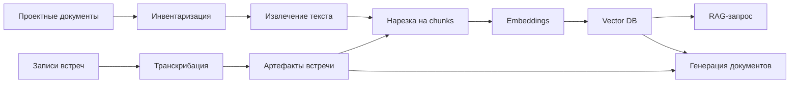

# Архитектура

## Общий Поток

## Компоненты

- **Инвентаризация**: находит файлы и сохраняет metadata.
- **Извлечение**: превращает документы в нормализованный текст.
- **Chunking**: режет текст на поисковые фрагменты.
- **Embedding**: вызывает Ollama `bge-m3` с `num_ctx=8192`.
- **Vector Store**: хранит searchable chunks в ChromaDB.
- **Meeting Processor**: транскрибирует встречи и создает артефакты.
- **Классификатор**: назначает этап проекта, ФТТ, документ, задачу и сдачный результат.
- **Генератор**: собирает черновики проектных документов из найденных источников.
- **Watchdog**: следит за долгой сборкой и восстанавливает Ollama при зависаниях.

## Runtime-Инварианты

- Название embedding-модели остается `bge-m3`.
- Каждый embedding-запрос использует `options.num_ctx=8192`.
- Embedding cache во время долгой сборки дописывается постепенно.
- Живой процесс `03_build_index.py` нельзя убивать watchdog-ом.
- Локальные runtime-данные не коммитятся в Git.

## Слои Хранения

- `data/manifest.jsonl`: найденные файлы.
- `data/extracted_text/`: cache извлеченного текста.
- `data/chunks.jsonl`: текущий набор chunks.
- `data/embeddings_cache.jsonl`: переиспользуемый cache embeddings.
- `vector_db/`: persistent-индекс ChromaDB.
- `logs/`: операционные логи и markers.

