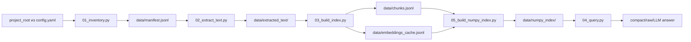
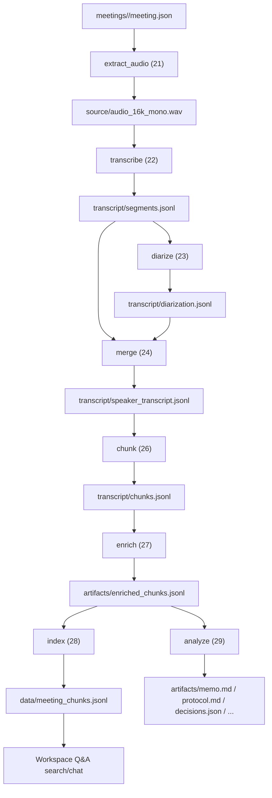
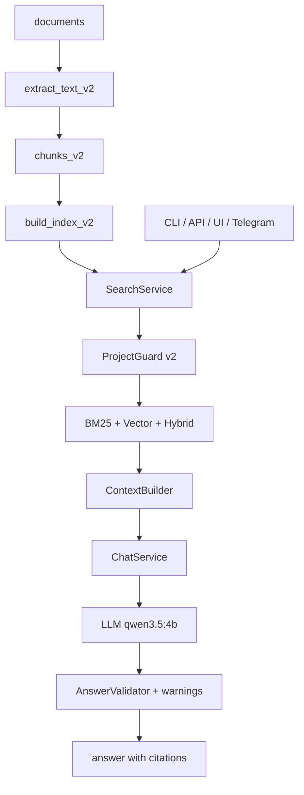
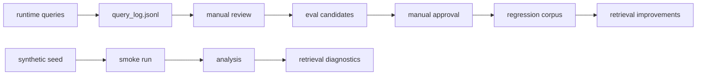

# Архитектура MeetingAgent

Обновлено: 2026-07-02.

## Назначение

MeetingAgent — локальный репозиторий проектной памяти. В нём сейчас живут четыре связанных, но разных контура:

1. **Baseline RAG MeetingAgent v1** — сборка корпуса, embeddings cache, numpy-index и запросы через `scripts/04_query.py`.
2. **Meeting processing** — карточка встречи, offline ASR, оконный pipeline MAP -> REDUCE -> RENDER.
3. **Project Knowledge Bot** — целевой runtime project-only бота в `src/asu_june_bot/` и `scripts/asu_june_bot_*.py`.
4. **Quality / dataset pipeline** — логирование запросов, ручной review, synthetic/realistic eval и regression candidates.

Важно: `scripts/09_chat.py` остаётся legacy/prototype поверх старого v1 RAG. Основной runtime бота — `src/asu_june_bot/`.

## Навигация по архитектуре

| Документ | Что описывает |
| --- | --- |
| `docs/architecture/PRODUCT_BOUNDARIES.md` | Границы продуктов, ownership-матрица, план разделения MeetingAgent и Project Knowledge Bot |
| `docs/architecture/TECHNICAL_FILE_RELATIONSHIPS.md` | Диаграммы технических файлов, вызовов, структур и данных MeetingAgent |
| `docs/architecture/MEETING_ARTIFACTS_PIPELINE.md` | Архитектура генерации итогов встречи MAP -> REDUCE -> RENDER |
| `docs/architecture/ADMIN_CONSOLE.md` | Контракт admin console: users/roles, auth settings, jobs, audit, health, RBAC |
| `docs/ru/ui_interaction_model.md` | Целевая table-first навигация MeetingAgent, API/UI states, роли и responsive-макеты |
| `docs/architecture/FOLDER_STRUCTURE.md` | Базовая структура папок встреч |
| `docs/project_knowledge_bot.md` | Обзор Project Knowledge Bot |
| `docs/quality/QUERY_FEEDBACK_LOOP.md` | Feedback loop для baseline RAG / dataset helpers |

## Контур 1. Baseline RAG v1

```mermaid
flowchart LR
    A["project_root из config.yaml"] --> B["01_inventory.py"]
    B --> C["data/manifest.jsonl"]
    C --> D["02_extract_text.py"]
    D --> E["data/extracted_text/"]
    E --> F["03_build_index.py"]
    F --> G["data/chunks.jsonl"]
    F --> H["data/embeddings_cache.jsonl"]
    G --> I["05_build_numpy_index.py"]
    H --> I
    I --> J["data/numpy_index/"]
    J --> K["04_query.py"]
    K --> L["compact/raw/LLM answer"]
```

Инварианты:

- embedding model: `bge-m3`;
- каждый embedding-запрос использует `options.num_ctx=8192`;
- ChromaDB не является критическим search backend;
- `data/embeddings_cache.jsonl` нельзя удалять при восстановлении после сбоя;
- `vector_db/` считается legacy runtime-папкой.

## Контур 2. Meeting processing

```mermaid
flowchart TD
    A["meetings/<meeting_id>/meeting.json"] --> B["extract_audio (21)"]
    B --> C["source/audio_16k_mono.wav"]
    C --> D["transcribe (22)"]
    D --> E["transcript/segments.jsonl"]
    E --> F["diarize (23)"]
    F --> G["transcript/diarization.jsonl"]
    E --> H["merge (24)"]
    G --> H
    H --> I["transcript/speaker_transcript.jsonl"]
    I --> J["chunk (26)"]
    J --> K["transcript/chunks.jsonl"]
    K --> L["enrich (27)"]
    L --> M["artifacts/enriched_chunks.jsonl"]
    M --> N["index (28)"]
    N --> O["data/meeting_chunks.jsonl"]
    O --> P["Workspace Q&A search/chat"]
    M --> Q["analyze (29)"]
    Q --> R["artifacts/memo.md / protocol.md / decisions.json / ..."]
```

Стадии `extract_audio`, `transcribe`, `diarize`, `merge`,
`resolve_speakers`, `chunk`, `enrich`, `index`, `analyze`,
`index_artifacts` реализованы в job runner и доступны через Workspace Pipeline
panel и `POST /meetings/{id}/jobs/{stage}`. `resolve_speakers` материализует
ручные speaker mapping/override поверх неизменяемого raw speaker transcript.
Полный профиль завершает цепочку как
`resolve_speakers -> chunk -> enrich -> index -> analyze -> index_artifacts`.
После ручной правки профиль `speaker_rebuild` выполняет только этот зависимый
хвост и не запускает extract/ASR/diarization/merge.

Preflight для каждой стадии:
- `extract_audio`: ffmpeg в PATH + существующий source media файл
- `merge`: наличие `segments.jsonl`
- `chunk`: наличие `speaker_transcript.jsonl`
- `enrich`: наличие `chunks.jsonl`
- `index`, `analyze`: наличие `enriched_chunks.jsonl`
- `index_artifacts`: наличие всех structured JSON-артефактов анализа

Стадия `index` делает upsert в `data/meeting_chunks.jsonl` по `meeting_id` (замещает строки той же встречи, сохраняет другие). После `index` workspace Q&A (`POST /meetings/{id}/search` и `/chat`) может находить чанки этой встречи.

Стадия `transcribe` через runner жёстко передаёт `--model large-v3-turbo` (продуктовый offline ASR). Без явного `--model` скрипт падает на fallback `small`, если локальный `transcription.model` не задан, — это молча понизило бы качество UI-транскрипции до черновика. `small` остаётся доступен только через явный CLI `--model` для черновиков.

Стадия `analyze` запускается в режиме `extractive` (без LLM), продуцирует `artifacts/summary.md`, `artifacts/protocol.md` и JSON-артефакты решений/задач/рисков/вопросов.

`07_generate_meeting_artifacts.py` остаётся ранним генератором `summarized`-состояния. `08_process_meeting_pipeline.py` — standalone MAP-REDUCE скрипт, не в runner.

### Meeting Workspace UI

`GET /MeetingAgent` отдаёт table-first реестр встреч; `/MeetingAgent/new` и
`/MeetingAgent/processing` открывают адресуемые состояния создания и мониторинга.
`GET /meetings/{id}/workspace` отдаёт вкладочный single-page UI встречи:
медиаплеер, кликабельный транскрипт (seek по сегментам), сопоставление спикеров,
артефакты, meeting-scoped Q&A, Live и панель Pipeline. MeetingAgent/Workspace
используют `/assets/v2/*`; Project Knowledge Bot и admin сохраняют независимый
`/assets/v1/*` контракт.

Pipeline-панель управляет job runner-ом из браузера:

- `GET /meetings/{id}/jobs/stages` — список запускаемых стадий (`jobs.read`);
  отдаёт все стадии, которые реально умеет runner, включая
  `resolve_speakers`, без путей ФС и командных строк;
- `GET /meetings/{id}/speakers/rebuild` — path-safe состояние ревизий
  speaker-dependent outputs (`jobs.read`);
- `POST /meetings/{id}/jobs/speaker-rebuild` — фиксированный resumable rebuild
  зависимого хвоста (`jobs.start` + CSRF для browser session);
- `GET /meetings/{id}/pipeline/readiness` — карта готовности стадий (`done`/`ready`/`blocked`), `can_run`, machine-readable `reason`, required/produced artifacts без путей ФС;
- `POST /meetings/{id}/jobs/pipeline` — последовательный one-click запуск профилей `default`, `full`, `transcript_only`, `qa_ready`; готовые стадии пропускаются без `force`;
- Start/Cancel вызывают существующие `POST /meetings/{id}/jobs/{stage}` (`jobs.start`) и `.../cancel` (`jobs.cancel`).

CSRF-поток для браузерных write-действий: при login выставляется non-HttpOnly cookie `ma_session_csrf`; JS получает токен через `GET /auth/csrf` (валидирует cookie против session hash, не создаёт сессию, не раскрывает hash) и шлёт его как `X-CSRF-Token`. Machine Bearer-вызовы CSRF-exempt. CSRF-токен в JS живёт только в памяти, не пишется в DOM/persistent storage. Все динамические значения job/stage рендерятся через DOM API + `textContent`/`dataset` + `addEventListener` (без inline-интерполяции).

CSP-гигиена: ни один HTML-элемент страницы не несёт inline `on*`-обработчиков. Все интерактивные элементы (header refresh, фильтр транскрипта, close-artifact, клики по сегментам транскрипта, медиа-переключатель, артефакты, job/stage-кнопки, Q&A) привязаны через `addEventListener`, а данные передаются через `data-*`/`dataset` (`data-start-sec` для seek по сегменту). Это позволяет в дальнейшем применить строгий CSP без `unsafe-inline` для обработчиков.

#### Meeting-scoped search & Q&A

Панель Q&A workspace-а обращается к meeting-scoped эндпоинтам:

- `POST /meetings/{id}/search` (`search.use`) — поиск по чанкам ОДНОЙ встречи;
- `POST /meetings/{id}/chat` (`chat.use` + CSRF для cookie, Bearer exempt) — grounded-ответ только по этой встрече, с цитатами.

Реализованы через отдельный `MeetingQAService` (`meetings/qa.py`), сознательно НЕ переиспользующий project `SearchService`/`ChatService`: те запускают project-only `ProjectGuard` (отклонил бы вопросы о встрече) и ищут по проектному корпусу (риск утечки project/global чанков). MeetingQAService читает `data/meeting_chunks.jsonl`, жёстко фильтрует по `meeting_id` ∩ meeting-типам источников (`meeting_chunk`/`meeting_decision`/`meeting_action_item`/`meeting_risk`/`meeting_open_question`) и формирует ответ только по найденным чанкам.

Retrieval v2: если доступен Ollama embedding backend (`bge-m3`), используется semantic vector retrieval с cosine similarity и fusion с lexical score; embeddings лениво кэшируются в `data/meeting_embeddings_cache.jsonl` по `meeting_id + chunk_id + text_sha256 + embedding_model`. Если Ollama/retriever недоступен, endpoint не падает и возвращается к lexical fallback. Ответы содержат `retrieval_mode = "vector"` или `"lexical"`, а Workspace показывает это как `semantic`/`lexical`.

Изоляция и безопасность: неизвестная/небезопасная встреча → 404; отсутствует индекс/файл чанков → 200 с `available:false` и пустыми результатами (не 500); в ответах нет путей ФС и сырых ошибок бэкенда; цитаты только из возвращённых meeting-источников (без галлюцинаций). Форма цитаты: `chunk_id`, `excerpt`, `artifact`, `segment_id`, `speaker`, `start_sec`, `end_sec`. По клику на цитату/результат с `start_sec` плеер перематывается на таймкод. Это контур MeetingAgent Core, изолированный от Project Knowledge Bot.

Цитаты chat-а не завышают доказательную базу: ответ парсится на маркеры `[S#]`, и в `citations` попадают только реально процитированные источники. Поле `citations_basis` различает режимы: `"cited"` — отфильтровано по `[S#]` из ответа; `"retrieved"` — модель не проставила распознаваемых маркеров, поэтому показаны все найденные источники; `null` — ответ не сформирован (refusal). Маркеры на источники вне диапазона (`[S9]` при 2 фрагментах) игнорируются.

Известные ограничения: `segment_id` пока `null` (чанки — это окна, а не сегменты транскрипта); точное сопоставление chunk/utterance -> transcript segment вынесено в #126. `data/meeting_chunks.jsonl` наполняется стадией `index` job runner-а.

## Контур 3. Project Knowledge Bot

```mermaid
flowchart TD
    A["documents"] --> B["extract_text_v2"]
    B --> C["chunks_v2"]
    C --> D["build_index_v2"]
    D --> E["SearchService"]
    U["CLI / API / UI / Telegram"] --> E
    E --> F["ProjectGuard v2"]
    F --> G["BM25 + Vector + Hybrid"]
    G --> H["ContextBuilder"]
    H --> I["ChatService"]
    I --> J["LLM qwen3.5:4b"]
    J --> K["AnswerValidator + warnings"]
    K --> L["answer with citations"]
```

Фактический runtime:

- `src/asu_june_bot/api/`;
- `src/asu_june_bot/search/`;
- `src/asu_june_bot/chat/`;
- `src/asu_june_bot/retrieval/`;
- `src/asu_june_bot/guardrails/`;
- `src/asu_june_bot/observability/`;
- `scripts/asu_june_bot_*.py`.

Текущий runtime включает API, Web UI, Telegram adapter, review queue, guard cases export/regression harness и локальную модель по умолчанию `qwen3.5:4b`. Guard v2 runtime остаётся отдельной задачей (#106).

## Контур 4. Quality / dataset pipeline

```mermaid
flowchart LR
    A["runtime queries"] --> B["query_log.jsonl"]
    B --> C["manual review"]
    C --> D["eval candidates"]
    D --> E["manual approval"]
    E --> F["regression corpus"]
    F --> G["retrieval improvements"]

    H["synthetic seed"] --> I["smoke run"]
    I --> J["analysis"]
    J --> K["retrieval diagnostics"]
```

Этот контур не обучает веса LLM. Он нужен для измеримого улучшения retrieval, guardrails, source filtering и качества ответов.

## Главные архитектурные решения

- `main` — каноническая ветка. Реализации из feature/PR-веток должны попадать в `main` или явно фиксироваться как отложенные.
- Project Knowledge Bot развивается отдельно от старого `scripts/09_chat.py`.
- `/search` возвращает evidence/context, `/chat` возвращает answer with citations.
- Внепроектные и mixed-scope запросы отсекаются до retrieval/LLM.
- Docker/local packaging развивается отдельной задачей (#124); runtime outputs и private corpora остаются локальными.
- Semantic/factual hard-fail не внедряется до накопления достаточного dataset.
