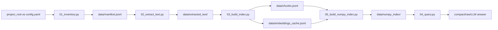
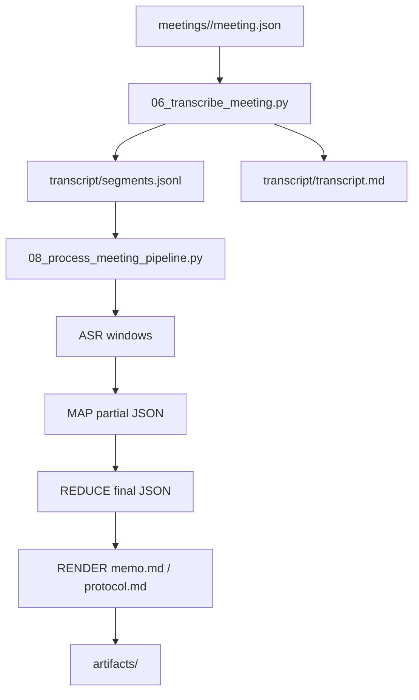
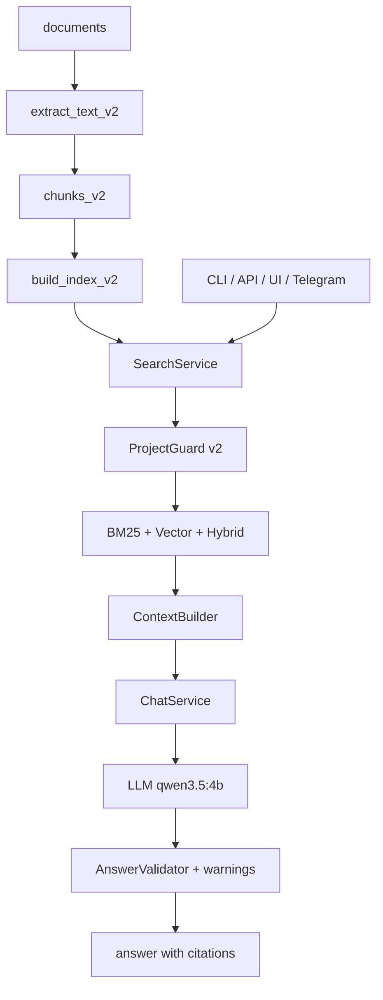
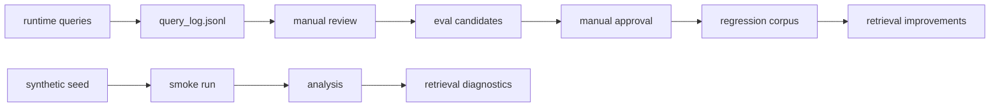

# Архитектура MeetingAgent

Обновлено: 2026-06-15.

## Назначение

MeetingAgent — локальный репозиторий проектной памяти. В нём сейчас живут четыре связанных, но разных контура:

1. **Baseline RAG MeetingAgent v1** — сборка корпуса, embeddings cache, numpy-index и запросы через `scripts/04_query.py`.
2. **Meeting processing** — карточка встречи, offline ASR, оконный pipeline MAP -> REDUCE -> RENDER.
3. **Project Knowledge Bot** — целевой runtime project-only бота в `src/asu_june_bot/` и `scripts/asu_june_bot_*.py`.
4. **Quality / dataset pipeline** — логирование запросов, ручной review, synthetic/realistic eval и regression candidates.

Важно: `scripts/09_chat.py` остаётся legacy/prototype поверх старого v1 RAG. Основной runtime бота — `src/asu_june_bot/`.

## Навигация по архитектуре

| Документ | Что описывает |
| --- | --- |
| `docs/architecture/PRODUCT_BOUNDARIES.md` | Границы продуктов, ownership-матрица, план разделения MeetingAgent и Project Knowledge Bot |
| `docs/architecture/TECHNICAL_FILE_RELATIONSHIPS.md` | Диаграммы технических файлов, вызовов, структур и данных MeetingAgent |
| `docs/architecture/MEETING_ARTIFACTS_PIPELINE.md` | Архитектура генерации итогов встречи MAP -> REDUCE -> RENDER |
| `docs/architecture/FOLDER_STRUCTURE.md` | Базовая структура папок встреч |
| `docs/subprojects/asu-june-bot/architecture.md` | Архитектура Project Knowledge Bot |
| `docs/subprojects/asu-june-bot/TECHNICAL_DIAGRAMS.md` | Диаграммы компонентов, вызовов, объектов и поведения бота |
| `docs/quality/QUERY_FEEDBACK_LOOP.md` | Feedback loop для baseline RAG / dataset helpers |
| `docs/subprojects/asu-june-bot/QUERY_FEEDBACK_LOOP.md` | Feedback loop целевого Project Knowledge Bot |

## Контур 1. Baseline RAG v1

```mermaid
flowchart LR
    A["project_root из config.yaml"] --> B["01_inventory.py"]
    B --> C["data/manifest.jsonl"]
    C --> D["02_extract_text.py"]
    D --> E["data/extracted_text/"]
    E --> F["03_build_index.py"]
    F --> G["data/chunks.jsonl"]
    F --> H["data/embeddings_cache.jsonl"]
    G --> I["05_build_numpy_index.py"]
    H --> I
    I --> J["data/numpy_index/"]
    J --> K["04_query.py"]
    K --> L["compact/raw/LLM answer"]
```

Инварианты:

- embedding model: `bge-m3`;
- каждый embedding-запрос использует `options.num_ctx=8192`;
- ChromaDB не является критическим search backend;
- `data/embeddings_cache.jsonl` нельзя удалять при восстановлении после сбоя;
- `vector_db/` считается legacy runtime-папкой.

## Контур 2. Meeting processing

```mermaid
flowchart TD
    A["meetings/<meeting_id>/meeting.json"] --> B["06_transcribe_meeting.py"]
    B --> C["transcript/segments.jsonl"]
    B --> D["transcript/transcript.md"]
    C --> E["08_process_meeting_pipeline.py"]
    E --> F["ASR windows"]
    F --> G["MAP partial JSON"]
    G --> H["REDUCE final JSON"]
    H --> I["RENDER memo.md / protocol.md"]
    I --> J["artifacts/"]
```

`07_generate_meeting_artifacts.py` остаётся ранним генератором `summarized`-состояния. Его `extractive`-режим — скаффолд контракта, не финальный продуктовый генератор memo/protocol.

### Meeting Workspace UI

`GET /meetings/{id}/workspace` отдаёт single-page UI встречи: медиаплеер, кликабельный транскрипт (seek по сегментам), просмотр текстовых артефактов, панель Pipeline.

Pipeline-панель управляет job runner-ом из браузера:

- `GET /meetings/{id}/jobs/stages` — список запускаемых стадий (`jobs.read`); отдаёт только стадии, которые реально умеет runner (`transcribe`, `diarize`, `merge`), без путей ФС;
- Start/Cancel вызывают существующие `POST /meetings/{id}/jobs/{stage}` (`jobs.start`) и `.../cancel` (`jobs.cancel`).

CSRF-поток для браузерных write-действий: при login выставляется non-HttpOnly cookie `ma_session_csrf`; JS получает токен через `GET /auth/csrf` (валидирует cookie против session hash, не создаёт сессию, не раскрывает hash) и шлёт его как `X-CSRF-Token`. Machine Bearer-вызовы CSRF-exempt. CSRF-токен в JS живёт только в памяти, не пишется в DOM/persistent storage. Все динамические значения job/stage рендерятся через DOM API + `textContent`/`dataset` + `addEventListener` (без inline-интерполяции).

#### Meeting-scoped search & Q&A

Панель Q&A workspace-а обращается к meeting-scoped эндпоинтам:

- `POST /meetings/{id}/search` (`search.use`) — лексический поиск по чанкам ОДНОЙ встречи;
- `POST /meetings/{id}/chat` (`chat.use` + CSRF для cookie, Bearer exempt) — grounded-ответ только по этой встрече, с цитатами.

Реализованы через отдельный `MeetingQAService` (`meetings/qa.py`), сознательно НЕ переиспользующий project `SearchService`/`ChatService`: те запускают project-only `ProjectGuard` (отклонил бы вопросы о встрече) и ищут по проектному корпусу (риск утечки project/global чанков). MeetingQAService читает `data/meeting_chunks.jsonl`, жёстко фильтрует по `meeting_id` ∩ meeting-типам источников (`meeting_chunk`/`meeting_decision`/`meeting_action_item`/`meeting_risk`/`meeting_open_question`), лексически ранжирует (MVP, как `scripts/31_meeting_search.py`) и формирует ответ только по найденным чанкам.

Изоляция и безопасность: неизвестная/небезопасная встреча → 404; отсутствует индекс/файл чанков → 200 с `available:false` и пустыми результатами (не 500); в ответах нет путей ФС и сырых ошибок бэкенда; цитаты только из возвращённых meeting-источников (без галлюцинаций). Форма цитаты: `chunk_id`, `excerpt`, `artifact`, `segment_id`, `speaker`, `start_sec`, `end_sec`. По клику на цитату/результат с `start_sec` плеер перематывается на таймкод. Это контур MeetingAgent Core, изолированный от Project Knowledge Bot.

Известные ограничения: retrieval лексический (не векторный); `segment_id` пока `null` (чанки — это окна, а не сегменты транскрипта); стадии вне transcribe/diarize/merge пока не реализованы (нужна поддержка в job runner).

## Контур 3. Project Knowledge Bot

```mermaid
flowchart TD
    A["documents"] --> B["extract_text_v2"]
    B --> C["chunks_v2"]
    C --> D["build_index_v2"]
    D --> E["SearchService"]
    U["CLI / API / UI / Telegram"] --> E
    E --> F["ProjectGuard v2"]
    F --> G["BM25 + Vector + Hybrid"]
    G --> H["ContextBuilder"]
    H --> I["ChatService"]
    I --> J["LLM qwen3.5:4b"]
    J --> K["AnswerValidator + warnings"]
    K --> L["answer with citations"]
```

Фактический runtime:

- `src/asu_june_bot/api/`;
- `src/asu_june_bot/search/`;
- `src/asu_june_bot/chat/`;
- `src/asu_june_bot/retrieval/`;
- `src/asu_june_bot/guardrails/`;
- `src/asu_june_bot/observability/`;
- `scripts/asu_june_bot_*.py`.

Roadmap текущего runtime: **QH-5 -> Telegram smoke -> final QH gate -> Docker**.

## Контур 4. Quality / dataset pipeline

```mermaid
flowchart LR
    A["runtime queries"] --> B["query_log.jsonl"]
    B --> C["manual review"]
    C --> D["eval candidates"]
    D --> E["manual approval"]
    E --> F["regression corpus"]
    F --> G["retrieval improvements"]

    H["synthetic seed"] --> I["smoke run"]
    I --> J["analysis"]
    J --> K["retrieval diagnostics"]
```

Этот контур не обучает веса LLM. Он нужен для измеримого улучшения retrieval, guardrails, source filtering и качества ответов.

## Главные архитектурные решения

- `main` — каноническая ветка. Реализации из feature/PR-веток должны попадать в `main` или явно фиксироваться как отложенные.
- Project Knowledge Bot развивается отдельно от старого `scripts/09_chat.py`.
- `/search` возвращает evidence/context, `/chat` возвращает answer with citations.
- Внепроектные и mixed-scope запросы отсекаются до retrieval/LLM.
- Docker не начинается до фактического QH-5 `PASSED`.
- Semantic/factual hard-fail не внедряется до накопления достаточного dataset.
