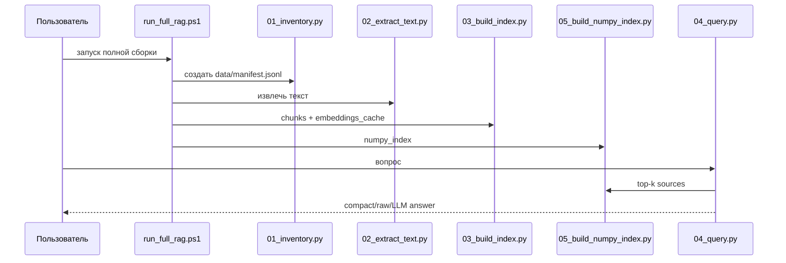
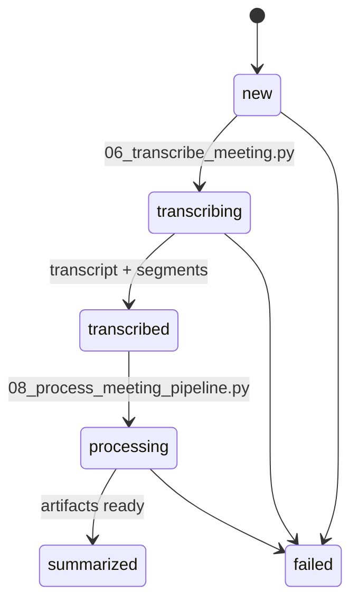
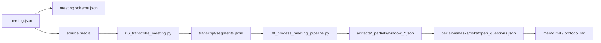
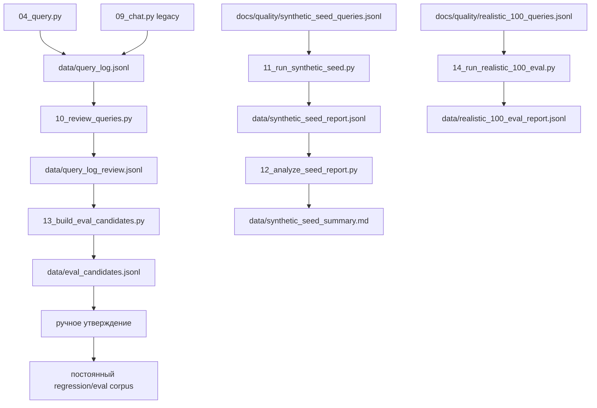
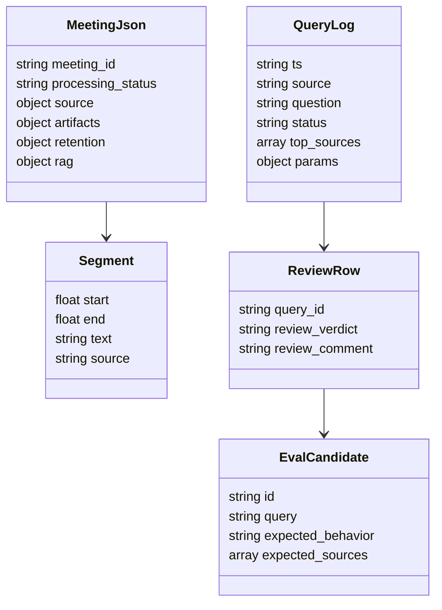

# Диаграммы технических файлов MeetingAgent

Обновлено: 2026-05-19.

## 1. Карта технических контуров

```mermaid
flowchart TD
    Repo["MeetingAgent repo"] --> RootDocs["README / AGENTS / docs/context / docs/todo"]
    Repo --> RAGv1["Baseline RAG v1"]
    Repo --> Meetings["Meeting processing"]
    Repo --> Bot["Project Knowledge Bot"]
    Repo --> Quality["Quality / dataset pipeline"]

    RAGv1 --> RAGScripts["scripts/01..05, 04_query.py, rag_numpy_backend.py"]
    RAGv1 --> RAGData["data/manifest, extracted_text, chunks, embeddings_cache, numpy_index"]

    Meetings --> MeetingSchema["configs/schemas/meeting.schema.json"]
    Meetings --> MeetingScripts["scripts/06, 07, 08"]
    Meetings --> MeetingPrompts["configs/prompts/meeting_*.md"]
    Meetings --> MeetingDocs["docs/architecture/MEETING_ARTIFACTS_PIPELINE.md"]

    Bot --> BotSrc["src/asu_june_bot/*"]
    Bot --> BotScripts["scripts/asu_june_bot_*.py"]
    Bot --> BotDocs["docs/subprojects/asu-june-bot/*"]
    Bot --> BotEval["eval/cases + tests/asu_june_bot"]

    Quality --> QualityDocs["docs/quality/*"]
    Quality --> QualityScripts["scripts/10..14 + rag_common.py"]
    Quality --> RuntimeLogs["data/query_log*.jsonl"]
```

## 2. Baseline RAG v1: вызовы файлов

## 3. Meeting pipeline: структура и поведение

## 4. Quality pipeline: query -> review -> candidates

## 5. Объектная модель ключевых JSON/JSONL

## 6. Что не смешивать

| Контур | Канонические файлы | Не считать основным runtime |
| --- | --- | --- |
| MeetingAgent RAG v1 | `scripts/01..05`, `04_query.py`, `data/numpy_index/` | ChromaDB / `vector_db/` |
| Project Knowledge Bot | `src/asu_june_bot/`, `scripts/asu_june_bot_*.py` | `scripts/09_chat.py` |
| Meeting artifacts | `06_transcribe_meeting.py`, `08_process_meeting_pipeline.py`, `meeting.schema.json` | `07_generate_meeting_artifacts.py extractive` как финальный генератор |
| Quality pipeline | `docs/quality/*`, `scripts/10..14` | fine-tuning / auto-promotion |
