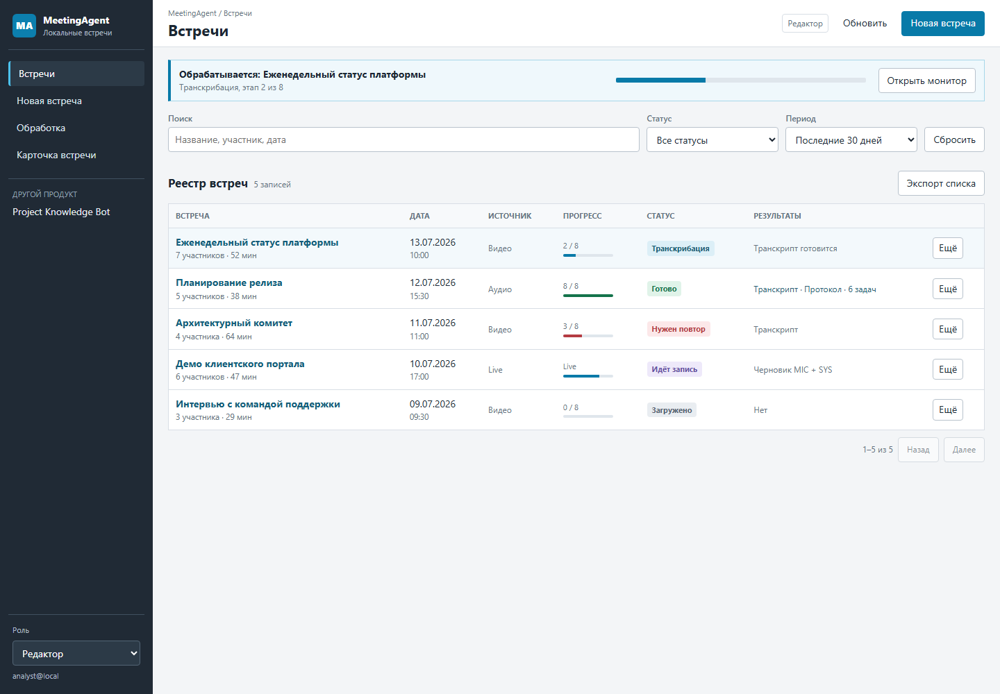
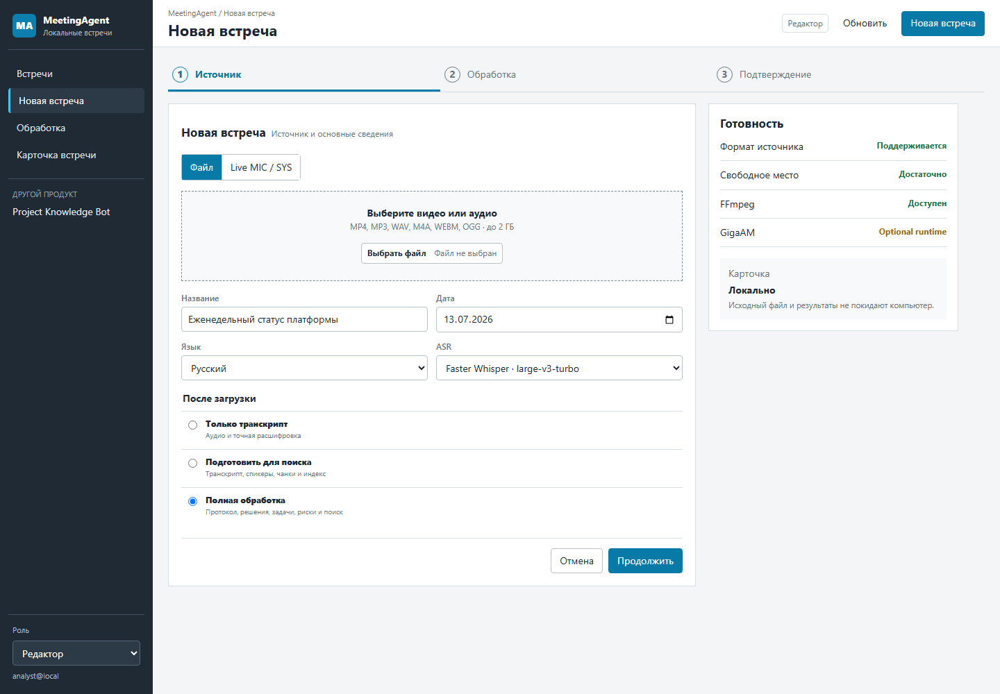
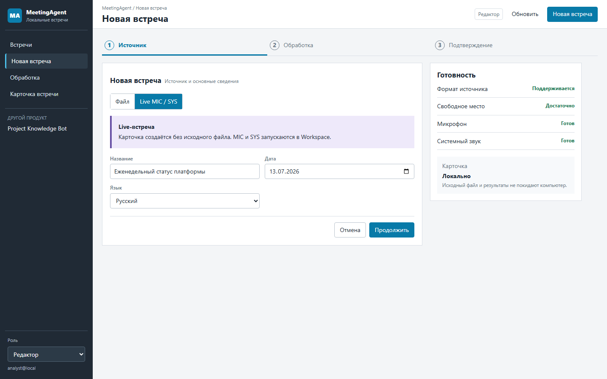
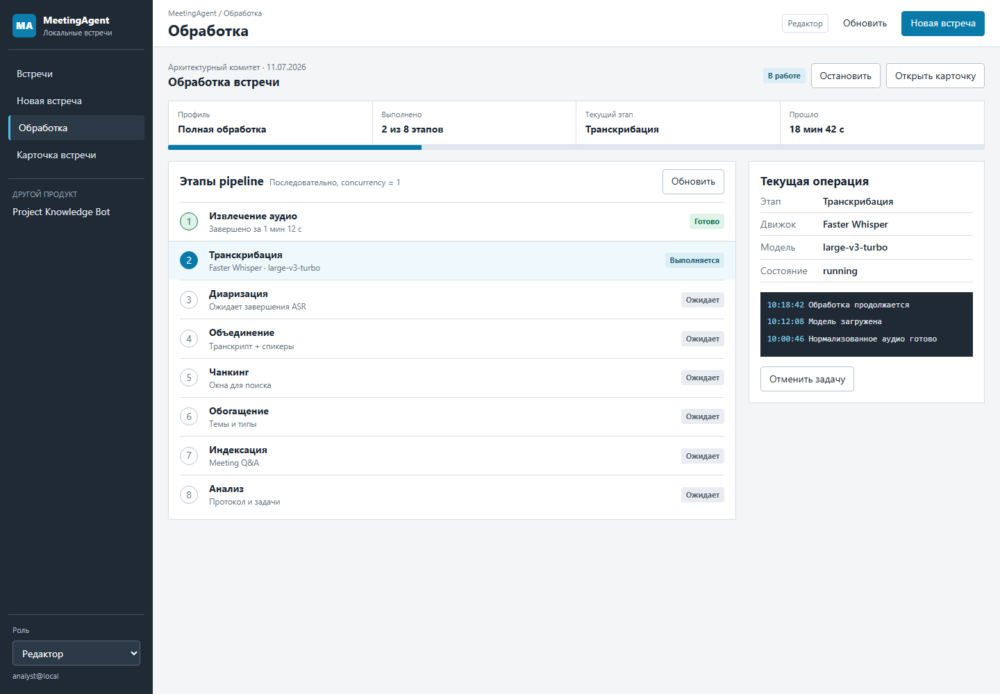
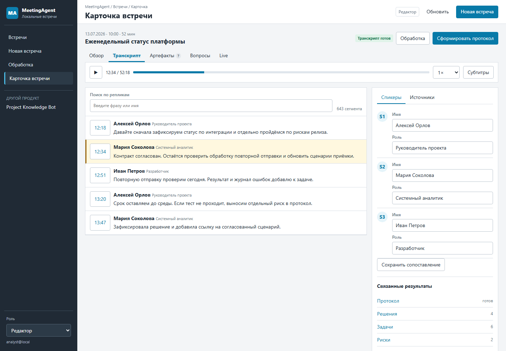
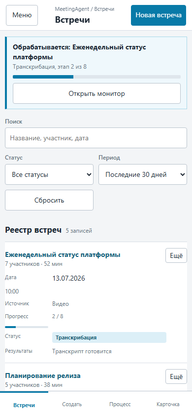
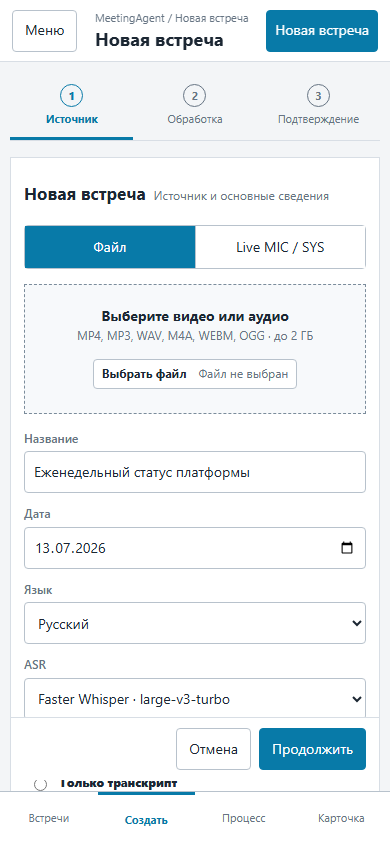
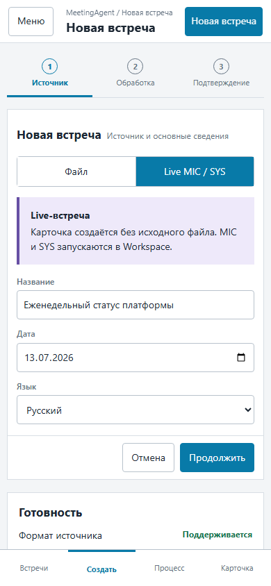
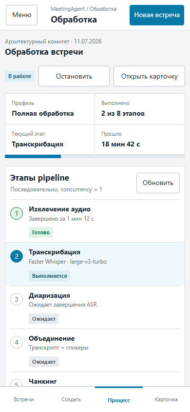
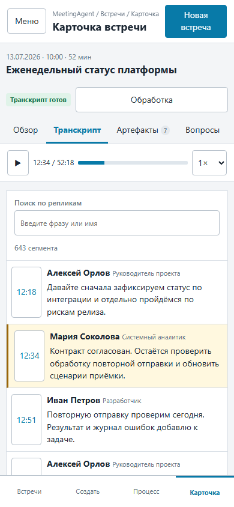

[English](ui_interaction_model.md) | [Русский](../ru/ui_interaction_model.md)

# MeetingAgent UI interaction model

Status: proposed for owner review in issue [#237](https://github.com/Anatoliy-Sysoev/MeetingAgent/issues/237). This document and the linked mockups do not change the production UI.

## Product boundary and navigation

MeetingAgent and Project Knowledge Bot remain separate products in one local runtime:

| Surface | Target route | Purpose |
| --- | --- | --- |
| Meeting registry | `/MeetingAgent` | Search, filter and open meeting cards |
| Create meeting | `/MeetingAgent/new` | Upload media or create a live-only card |
| Processing monitor | `/MeetingAgent/processing` | Follow the single active job and recover failures |
| Meeting Workspace | `/meetings/{meeting_id}/workspace` | Review one meeting and its evidence |
| Project Knowledge Bot | `/ui` | Search and chat over the separate project corpus |
| Administration | `/admin` | User and role management for administrators |

The first four routes describe the target information architecture. Only `/MeetingAgent` and the existing Workspace route are implemented today. The mockup must be approved before route or production-template changes.

## Surface hierarchy

### Registry

The registry is the default screen. It is a dense table with search, period/status filters, one active-work banner and row-level actions. Status, pipeline progress and available results are visible without opening a meeting. Upload and live creation start from one `New meeting` command.

### Upload and live creation

One three-step wizard owns both source modes:

1. source and meeting metadata;
2. processing profile and ASR engine;
3. preflight summary and explicit confirmation.

Upload accepts the supported local media formats and offers transcript-only, QA-ready or full processing. Live creation never invents source media; it creates a card and opens the Workspace where MIC/SYS capture starts.

### Processing monitor

The monitor shows one durable job or pipeline, its eight ordered stages, current child stage, bounded public events, cancellation and retry/resume actions. Stage readiness comes from the API; the browser does not infer it from filenames.

### Workspace

Workspace uses stable task tabs instead of one long panel column:

| Tab | Primary content | Context panel |
| --- | --- | --- |
| Overview | Meeting metadata, status, participants and result summary | Readiness and recent errors |
| Transcript | Media player and time-coded utterances | Speaker mapping and source references |
| Artifacts | Summary, protocol, decisions, tasks, risks, open questions | Confidence and `needs_review` |
| Questions | Meeting-scoped search and grounded Q&A | Exact segment citations |
| Live | MIC/SYS controls and one MIX conversation timeline | Capture readiness, warnings and offline refinement |
| Processing | Pipeline stages and current job | Retry/resume/cancel controls |

The media player remains available while moving between transcript, artifacts and Q&A. A citation opens the Transcript tab, seeks to the exact `segment_id`/timecode and highlights the utterance.

## API state mapping

The UI must render stable product states instead of raw JSON or local paths.

| API surface | Success and empty states | Blocked/error states | UI treatment |
| --- | --- | --- | --- |
| `GET /auth/me` | Signed-in identity and resolved permissions | `401` no session | Auth badge; sign-in screen, preserving intended destination |
| `POST /auth/local/login` | Session established | `401` invalid credentials, `429` throttled | Generic credential error or bounded retry timer |
| `GET /auth/csrf` | Token available in memory | `401`, `403`, `409` | Do not submit the write; refresh auth state, never persist token |
| `GET /meetings` | Table rows; `items=[]` empty registry; bounded partial `errors[]` | `401`, `403`, `5xx` | Skeleton, empty action, partial-warning row or retry banner |
| `POST /meetings/ingest` | `201` card created | `409` duplicate, `413` limit, `422` invalid, `503` busy, `500` failed | Upload progress; link duplicate to existing card; field/preflight error |
| `POST /meetings/live` | `201` live-only card | `422` invalid, `503` busy | Open Workspace on success; keep entered metadata on failure |
| `GET /meetings/{id}` | Meeting header and public metadata | `404`, `422` invalid card | Not-found page or bounded invalid-card recovery state |
| Transcript/media/artifact GET routes | Content available; empty artifact/media lists | `404`, `413`, `415`, `422` | Empty tab, too-large notice, unsupported preview/download alternative |
| Speakers GET/PUT | Labels and saved mapping | no labels, `403`, `422` | Empty mapping state; read-only for viewer; inline validation for editor |
| `GET .../pipeline/readiness` | `done`, `ready`, `ready_for_retry`, `blocked` | `404`, `503` | Stage rows use server state and bounded reason; no guessed Start button |
| Stage/pipeline POST routes | `202` durable `job_id` | `409` active/conflict, `422` preflight, `503` state unavailable | Track returned ID; disable conflicting actions; show retryable reason |
| `GET .../jobs/{job_id}` | `starting`, `running`, `completed`, `failed`, `cancelled`, `orphaned` | `404` lost ID, `503` store unavailable | Poll exact ID; terminal summary; explicit orphan recovery action |
| `GET /meetings/{id}/live/preflight`, `/live/sessions*` | available; `starting`, `running`, `stopping`, `completed` | unavailable reason, `409`, `422`, `503`, `failed`, `stale` | Source-specific readiness; graceful stop; keep final draft and warnings |
| `GET /meetings/{id}/live/timeline`, `GET/POST /live/refinement` | empty or bounded MIC/SYS/MIX events; `draft`, `refining`, `final`, `failed` | missing draft, active live/offline conflict, preflight failure | One chronological conversation; explicit resume/force; never index draft |
| `POST /meetings/{id}/search` | results with semantic/lexical mode; empty results | unavailable index or request failure | Empty evidence state; retrieval-mode label; exact seek targets |
| `POST /meetings/{id}/chat` | `answered` with citations | `no_context`, `llm_unavailable`, `llm_error`, `no_answer` | Controlled explanation; never present a fragment as an answer |

Global HTTP handling is consistent: `401` requests sign-in, `403` distinguishes permission from stale CSRF, `404` does not reveal hidden cards, `409` is a workflow conflict, `422` is user-correctable input/preflight, `429` is throttling, and `5xx/503` offers retry with a bounded path-free message.

## Role visibility

| Capability | Viewer | Editor | Admin |
| --- | :---: | :---: | :---: |
| Registry, meeting, transcript, artifacts, search/Q&A | yes | yes | yes |
| Upload/live creation and pipeline controls | no | yes | yes |
| Speaker mapping and editable artifacts | no | yes | yes |
| User/role administration | no | no | yes |

Machine bearer tokens are service credentials and never appear as a browser role. Hidden controls are also rejected by server-side RBAC; visibility is not authorization.

## Responsive and accessibility rules

- Desktop uses a persistent product rail, full-width registry table and two-column Workspace.
- Below 700 px, the table becomes labeled records, navigation moves to a fixed bottom bar, and Workspace presents one task pane at a time.
- No hover-only action is required. Every command is a native button, link, input or select.
- Focus is always visible; the first keyboard target is a skip link. Side navigation supports arrow-key movement.
- Dynamic status uses `role=status` or `aria-live`; errors use `role=alert`.
- Viewer-only mode removes write controls but preserves context and explanations.
- Text does not depend on viewport-scaled font sizes; controls are at least 42 px high on narrow screens.
- No inline handlers/styles, persistent browser credentials or raw filesystem paths are permitted.

## Review mockups

Interactive public-safe prototype: [MeetingAgent UI v2](../ui-prototype/meetingagent-v2.html?screen=registry).

### Desktop

| Registry | Upload | Live creation |
| --- | --- | --- |
|  |  |  |

| Processing monitor | Workspace |
| --- | --- |
|  |  |

### Narrow screen

| Registry | Upload | Live creation |
| --- | --- | --- |
|  |  |  |

| Processing monitor | Workspace |
| --- | --- |
|  |  |

## Approval boundary

Approval of this document means the navigation, hierarchy, responsive behavior and state mapping can become the contract for separately scoped production implementation issues. It does not approve a framework migration, backend/API changes or visual decoration outside these workflows.
