# Карта Сущностей И Связей

Артефакт №4 серии полного ревью. Опирается на детальный разбор полей из `docs/review/03_data_schemas_catalog.md`.

Цель: показать **все сущности данных как единый граф** с явными и неявными FK, разделить параллельные namespace, зафиксировать «оборванные» связи (которые декларированы в схеме, но никем не пишутся).

## 1. Сводная ER-Диаграмма

Условные обозначения:
- `||--o{` — один-ко-многим (mandatory parent).
- `||--|{` — один-ко-многим (≥1 child).
- `||..o{` — связь **implicit by string equality** (нет реального FK, только совпадение полей `relative_path` / `sha256` / `chunk_id`).
- `}o..o{` — many-to-many неявная.
- Сущности, **никем не создаваемые** в текущем коде, помечены префиксом `RESERVED_`.

```mermaid
erDiagram

    %% ============ MAIN RAG NAMESPACE ============
    PROJECT_FILE ||--o{ MANIFEST_ROW : "1:1 by path"
    MANIFEST_ROW ||--o| EXTRACTED_TEXT_FILE : "if status=included"
    EXTRACTED_TEXT_FILE ||--o{ METADATA_ROW : "1:1"
    METADATA_ROW ||--|{ CHUNK : "splits into N"
    CHUNK ||--|| EMBEDDING_CACHE_ROW : "1:1 by chunk_id"
    CHUNK }|--|| NUMPY_INDEX_ROW : "merged into row"
    EMBEDDING_CACHE_ROW }|--|| NUMPY_INDEX_ROW : "merged into row"
    NUMPY_INDEX_ROW }|--|| NUMPY_INDEX_MANIFEST : "summarized by"

    %% ============ QUERY / FEEDBACK ============
    QUERY ||--|| QUERY_LOG_ENTRY : "1:1 if not sensitive"
    QUERY_LOG_ENTRY }o..o{ NUMPY_INDEX_ROW : "top_sources by relative_path+chunk_index"
    QUERY_LOG_ENTRY }o..o{ SOURCE_LINK : "join by relative_path"

    %% ============ MEETING NAMESPACE ============
    MEETING ||--|| MEETING_CARD : "1:1"
    MEETING_CARD ||--o{ MEDIA_FILE : "0..N"
    MEETING_CARD ||--o| TRANSCRIPT_SEGMENT_FILE : "after 06"
    TRANSCRIPT_SEGMENT_FILE ||--|{ TRANSCRIPT_SEGMENT : "JSONL rows"
    MEETING_CARD ||--o| TRANSCRIPT_MD : "after 06"
    MEETING_CARD ||--o| DECISIONS_DOC : "after 07/08"
    MEETING_CARD ||--o| TASKS_DOC : "after 07/08"
    MEETING_CARD ||--o| RISKS_DOC : "after 07/08"
    MEETING_CARD ||--o| OPEN_QUESTIONS_DOC : "after 07/08"
    MEETING_CARD ||--o| MEMO_MD : "after 07/08"
    MEETING_CARD ||--o| PROTOCOL_MD : "after 07/08"
    MEETING_CARD ||--o| PIPELINE_REPORT_MD : "after 08"

    DECISIONS_DOC ||--|{ DECISION_ITEM : "items[]"
    TASKS_DOC ||--|{ TASK_ITEM : "items[]"
    RISKS_DOC ||--|{ RISK_ITEM : "items[]"
    OPEN_QUESTIONS_DOC ||--|{ OPEN_QUESTION_ITEM : "items[]"

    DECISION_ITEM ||--|{ SOURCE_REF : "≥1"
    TASK_ITEM ||--|{ SOURCE_REF : "≥1"
    RISK_ITEM ||--|{ SOURCE_REF : "≥1"
    OPEN_QUESTION_ITEM ||--|{ SOURCE_REF : "≥1"

    SOURCE_REF }o..o| TRANSCRIPT_SEGMENT : "kind=transcript_segment, by segment_index"
    SOURCE_REF }o..o| NUMPY_INDEX_ROW : "kind=rag_source, by relative_path"

    %% ============ PIPELINE PARTIALS (resume cache) ============
    MEETING_CARD ||--o{ MAP_PARTIAL : "08/07 _partials/window_X.json"
    MAP_PARTIAL ||--o| MAP_PARTIAL_RAW : "raw.txt sibling"
    MEETING_CARD ||--o| REDUCE_PARTIAL : "_partials/reduce.json"
    MEETING_CARD ||--o| RENDER_PARTIAL : "_partials/render.json (08 only)"
    MEETING_CARD ||--o{ WINDOW_AUDIO : "transcript/chunks/W*.wav (08 only)"
    MEETING_CARD ||--o{ WINDOW_SEGMENT_FILE : "transcript/chunks/W*.segments.jsonl (08)"

    %% ============ ASU JUNE BOT V2 — PARALLEL ============
    SUBPROJECT_FILE ||--o{ DOCUMENT_V2 : "1:1 by source_id"
    DOCUMENT_V2 ||--|{ BLOCK_V2 : "1:N by source_id"
    BLOCK_V2 ||--|{ CHUNK_V2 : "1:N by block_id"
    CHUNK_V2 }o..o| CHUNK_V2 : "parent_chunk_id self-FK"
    DOCUMENT_V2 ||--o{ EXTRACTION_ERROR_V2 : "if extract fails"
    CHUNK_V2 ||--o{ CHUNKING_REPORT_V2 : "aggregated"

    %% ============ QUALITY / EVAL ============
    RESERVED_EVAL_QUESTION }o..o{ NUMPY_INDEX_ROW : "expected_sources (Markdown only)"
    RESERVED_EVAL_BASELINE_ROW }o..o{ RESERVED_EVAL_QUESTION : "1:1 per run (Markdown only)"
    RESERVED_REVIEW_CARD }o..o{ QUERY_LOG_ENTRY : "review of (no code)"

    %% ============ RESERVED MEETING SECTIONS ============
    MEETING_CARD ||..o| RESERVED_CLASSIFICATION : "no producer"
    MEETING_CARD ||..o| RESERVED_LINKS : "no producer"
    MEETING_CARD ||..o| RESERVED_RAG_INDEXATION : "no producer"
    MEETING_CARD ||..o| RESERVED_CLASSIFICATION_REPORT : "no producer"
```



## 2. Связи Реальные Vs Implicit-By-String

Ключевая проблема архитектуры: **большинство FK не enforced**. Связь существует только если в двух разных JSON / JSONL файлах совпали строковые значения. Никакой кросс-валидации нет.

| Источник | Поле | Цель | Поле | Тип | Enforced? |
|---|---|---|---|---|---|
| `manifest.jsonl` | `path`, `sha256` | `extracted_text/_metadata.jsonl` | `source_path`, `sha256` | 1:1 | implicit (02 копирует) |
| `manifest.jsonl` | `relative_path` | filesystem | — | 1:1 | implicit by string |
| `_metadata.jsonl` | `extracted_path` | `extracted_text/<rel_id>.<sha>.txt` | — | 1:1 | implicit (02 пишет файл, 03 читает) |
| `_metadata.jsonl` | `sha256` | `chunks.jsonl` | `sha256` | 1:N | implicit |
| `chunks.jsonl` | `chunk_id` | `embeddings_cache.jsonl` | `chunk_id` | 1:1 | implicit, **stale записи в кэше** |
| `chunks.jsonl` | `chunk_id` | `numpy_index/metadata.jsonl` | `metadata.chunk_id` | 1:1 | implicit (05 копирует) |
| `numpy_index/metadata.jsonl` | `row_id` | `numpy_index/embeddings.npy` | row index | 1:1 | **enforced**: `count`-check в `manifest.json` (`rag_numpy_backend.py:157`) |
| `query_log.jsonl` | `top_sources[].relative_path` + `chunk_index` | `numpy_index/metadata.jsonl` | `metadata.relative_path` + `metadata.chunk_index` | N:N | implicit, **не уникально**: один chunk может иметь несколько dедупов |
| `query_log.jsonl` | `top_sources[].relative_path` | `source_links.json` | ключ | N:1 | implicit, join при рендере |
| `meeting.json` | `meeting_id` | filename `meetings/<meeting_id>/` | — | 1:1 | implicit by directory name |
| `meeting.json` | `artifacts.<x>` | `meetings/<id>/<artifacts.x>` | — | 1:1 | проверяется в 06 (`validate_transcribed_status`); в 07/08 — только при записи |
| `meeting.json` | `source.media_files[].path` | `meetings/<id>/<path>` | — | 1:1 | implicit; 06 ищет media через `get_source_media`, ошибка если нет |
| `decisions.json` etc. | `source_refs[].path` + `segment_index` | `transcript/segments.jsonl` (строка N) | — | N:1 | **enforced на REDUCE в 08**: `collect_source_ref_pool` нормализует по реальному segments.jsonl |
| `decisions.json` etc. | `source_refs[].path` (`kind=rag_source`) | `numpy_index/metadata.jsonl` `relative_path` | — | N:1 | implicit, **никогда не проверяется** (RAG для встреч ещё не реализован) |
| `_partials/window_<id>.json` | `window_id` | filename | — | 1:1 | implicit; 08 использует для resume |
| `meeting.json` | `rag.indexed_artifacts[]` | `meetings/<id>/<path>` | — | 1:N | **RESERVED**, никем не пишется |
| `meeting.json` | `classification.{ftt,document,task}_candidates[].id` | внешний справочник (`PROJECT_TAXONOMY.md`) | — | N:1 | **RESERVED** |
| `meeting.json` | `links.related_*[].id_or_path` | другая встреча / документ | — | N:1 | **RESERVED** |
| `chunks_v2.jsonl` | `block_id` | `blocks.jsonl` | `block_id` | N:1 | implicit |
| `chunks_v2.jsonl` | `parent_chunk_id` | `chunks_v2.jsonl` | `chunk_id` (другая строка) | N:1 | implicit self-FK |
| `blocks.jsonl` | `source_id` | `documents.jsonl` | `source_id` | N:1 | implicit |

## 3. Параллельные Namespace

В репозитории **сосуществуют два независимых RAG-pipeline**, которые **не пересекаются ни одной FK**:

### 3.1 Основной RAG (продакшн чата)

```
PROJECT_FILE (project_root/*)
   → MANIFEST_ROW (data/manifest.jsonl)
   → EXTRACTED_TEXT_FILE (data/extracted_text/*.txt)
   → METADATA_ROW (data/extracted_text/_metadata.jsonl)
   → CHUNK (data/chunks.jsonl)                          chunk_id = stable_id(24)
   → EMBEDDING_CACHE_ROW (data/embeddings_cache.jsonl)
   → NUMPY_INDEX_ROW (data/numpy_index/*)
   ← QUERY (от 04_query / 09_chat)
   → QUERY_LOG_ENTRY (data/query_log.jsonl)
```

### 3.2 Подпроект Asu June Bot v2

```
SUBPROJECT_FILE (тот же project_root, но другая фильтрация)
   → DOCUMENT_V2 (data/asu_june_bot/extracted_v2/documents.jsonl)
   → BLOCK_V2    (data/asu_june_bot/extracted_v2/blocks.jsonl)   block_id = stable_id(32)
   → CHUNK_V2    (data/asu_june_bot/chunks_v2.jsonl)              chunk_id = stable_id(32, prefix "v2:")
   → отдельный retrieval (hybrid retriever в src/asu_june_bot/retrieval/)
```

### 3.3 Граница

| Аспект | Main RAG | Asu June Bot v2 |
|---|---|---|
| Корневой config | `config.example.yaml::paths.*` | `config.example.yaml::asu_june_bot.*` |
| Куда пишет | `data/` | `data/asu_june_bot/` |
| `chunk_id` namespace | sha256 hex 24 (без префикса) | sha256 hex 32 с префиксом `"v2:"` |
| Index backend | `data/numpy_index/` (NumpyRagIndex) | hybrid retriever в коде, без отдельного persisted index |
| Кто читает в чате | `09_chat.py` | **никто из top-level скриптов**; только тесты подпроекта |
| Метаданные | плоские (path, sha, chars) | богатые (stage, module, section, requirement_id…) |

**Пересечений сущностей нет.** Один и тот же `SUBPROJECT_FILE` может одновременно стать `MANIFEST_ROW` и `DOCUMENT_V2`, но никакая структура их не связывает — это два **полностью независимых** pipeline над одним корнем.

См. артефакт №7 ревью (подпроекты) — там разворачивается, почему так и стоит ли это унифицировать.

## 4. Cardinality-Сводка

| Сущность | Кардинальность относительно проекта/встречи |
|---|---|
| `MANIFEST_ROW` | N на проект (один на файл в `project_root`) |
| `METADATA_ROW` | M ≤ N на проект (только `status=included`) |
| `EXTRACTED_TEXT_FILE` | M на проект |
| `CHUNK` | K = sum(chunks_per_file), типично 3-30 на документ |
| `EMBEDDING_CACHE_ROW` | ≥ K (накапливаются stale) |
| `NUMPY_INDEX_ROW` | K (всегда = текущему числу chunks) |
| `QUERY_LOG_ENTRY` | unbounded, append-only |
| `MEETING_CARD` | 1 на встречу |
| `TRANSCRIPT_SEGMENT` | сотни-тысячи на встречу |
| `MEDIA_FILE` | 0..3 на встречу (MIC + SYS + опц. video) |
| `DECISION_ITEM` / `TASK_ITEM` / `RISK_ITEM` / `OPEN_QUESTION_ITEM` | 0..N на встречу, на практике 1-15 |
| `SOURCE_REF` | ≥1 на каждый item (schema-required) |
| `MAP_PARTIAL` | N окон (зависит от длины transcript / `window_seconds`) |
| `REDUCE_PARTIAL` | 1 на встречу |
| `RENDER_PARTIAL` | 0..1 на встречу (только 08) |
| `WINDOW_AUDIO` / `WINDOW_SEGMENT_FILE` | N окон (только 08) |
| `DOCUMENT_V2` | M на subproject (фильтрованный subset проекта) |
| `BLOCK_V2` | большой множитель (десятки на документ) |
| `CHUNK_V2` | ≥ BLOCK_V2 (parent + block chunks) |

## 5. Оборванные Связи (Контракт Без Реализации)

Эти связи объявлены в JSON-схемах, но **никто их не создаёт**:

| Контракт | Где задан | Что должно ссылаться | Текущее состояние |
|---|---|---|---|
| `meeting.rag.indexed_artifacts[]` → файлы артефактов встречи внутри основного RAG | `meeting.schema.json:269-274` | `numpy_index/metadata.jsonl` | Инкрементальная индексация встречи не реализована. Artifacts встречи **не попадают** в основной index. |
| `meeting.rag.last_indexed_at` | `meeting.schema.json:283-286` | — | Никогда не выставляется. |
| `meeting.classification.*_candidates[].id` → внешние сущности | `meeting.schema.json:164-202` | `docs/product/PROJECT_TAXONOMY.md` (PRJ-XX, FTT-XX, …) | Классификатор не реализован. Поле всегда отсутствует. |
| `meeting.classification.summary` / `confidence` / `needs_review` | то же | — | То же. |
| `meeting.links.related_documents[]` | `meeting.schema.json:204-226` | другие meeting.json / документы | Linker не реализован. |
| `meeting.artifacts.classification_report` | `meeting.schema.json:159-161` | `meetings/<id>/artifacts/classification_report.*` | Никем не пишется. |
| `meeting.processing_status` `classified` / `indexed` | `meeting.schema.json:114-125` | — | Не выставляется ни одним скриптом. |
| `RESERVED_EVAL_QUESTION` | `docs/quality/rag_eval_questions.md` (Markdown) | RAG | Существует только как человеческая таблица. **Машинной сущности нет.** |
| `RESERVED_EVAL_BASELINE_ROW` | `docs/quality/rag_eval_baseline_clean_*.md` (Markdown) | `RESERVED_EVAL_QUESTION` | Markdown, обновляется вручную. Логи прогона `logs/rag_eval_clean_*_raw.jsonl` — локальные, не коммитятся. |
| `RESERVED_REVIEW_CARD` | `docs/quality/QUERY_FEEDBACK_LOOP.md` шаг 3-5 | `QUERY_LOG_ENTRY` | Процесс описан, но никакого `review_log` / `review_cards.json` в коде нет. Разметка идёт вручную в голове / тикетах. |

## 6. Identifier-Namespace И Коллизии

| ID | Namespace | Алгоритм | Длина | Коллизионная вероятность для текущего корпуса |
|---|---|---|---|---|
| `chunk_id` (main) | глобальный по проекту | sha256(sha256+index+text[:120])[:24] | 96 bit | пренебрежимо |
| `db_id` (main) | глобальный | sha256(rel+sha+index+text[:120])[:24] | 96 bit | пренебрежимо |
| `chunk_id` (v2) | глобальный по подпроекту | sha256("v2:"+source_id+block_id+...)[:32] | 128 bit | пренебрежимо |
| `block_id` (v2) | глобальный по подпроекту | sha256(...)[:32] | 128 bit | пренебрежимо |
| `source_id` (v2) | глобальный по подпроекту | per `make_source_document` (sha256 source_path?) | — | n/a |
| `meeting_id` | глобальный | человекочитаемый slug | — | **возможна коллизия** при двух встречах с одинаковой датой+title; ни один код не проверяет уникальность |
| `decision_id` / `task_id` / `risk_id` / `question_id` | локальный по встрече | `^(DEC\|TASK\|RISK\|Q)-\d{3}$` (NNN ≤ 999) | — | per-meeting; **глобально не уникально**: DEC-001 во встрече А ≠ DEC-001 во встрече B |
| `window_id` | локальный по встрече | `W<NN>` (`08`), просто `str(index)` (`07`) | — | per-meeting |
| `row_id` (numpy_index) | локальный по индексу | int 0..N-1 | — | per-index, инвалидируется при пересборке |

**Важно:** `decision_id` / `task_id` НЕ глобально уникальны. Если когда-то понадобится cross-meeting links (`MEETING.related_decisions[]` → `DECISION_ITEM`), потребуется составной ключ `(meeting_id, decision_id)`.

## 7. Реальные Кросс-Сущностные Сценарии (Use Cases)

### 7.1 Ответ чата на запрос

```
QUERY
  ↓ ollama_embed
QUERY_EMBEDDING (in-memory)
  ↓ NumpyRagIndex.query
NUMPY_INDEX_ROW × top_k
  ↓ payload + LLM prompt
ANSWER
  ↓ build_query_log_record
QUERY_LOG_ENTRY (с top_sources[].relative_path + chunk_index)
  ↓ optional render
SOURCE_LINK (если есть в source_links.json)
```

### 7.2 Обработка встречи pipeline 08

```
MEDIA_FILE (mic+sys → MIX)
  ↓ ffmpeg cut
WINDOW_AUDIO × N
  ↓ faster-whisper
WINDOW_SEGMENT_FILE × N
  ↓ concat
TRANSCRIPT_SEGMENT_FILE (segments.jsonl)
  ↓ build_segment_windows
TRANSCRIPT_WINDOW × N (in-memory)
  ↓ MAP-prompt + ollama_generate
MAP_PARTIAL × N
  ↓ collect_source_ref_pool (нормализация по segments.jsonl)
  ↓ REDUCE-prompt
REDUCE_PARTIAL (1)
  ↓ split items
DECISION_ITEM, TASK_ITEM, RISK_ITEM, OPEN_QUESTION_ITEM
  ↓ RENDER-prompt
RENDER_PARTIAL → MEMO_MD + PROTOCOL_MD
  ↓
PIPELINE_REPORT_MD (сводный)
  ↑ update
MEETING_CARD.artifacts.* + processing_status = summarized
```

### 7.3 Source-trace от ответа к транскрипту

```
DECISION_ITEM
  → source_refs[i]
  → если kind=transcript_segment:
       path = "transcript/segments.jsonl"
       segment_index = N
  → MEETING_CARD.meeting_id / артефакт path
  → TRANSCRIPT_SEGMENT (строка N в JSONL)
  → start, end → можно открыть исходное audio MEDIA_FILE
```

Это **единственный полностью замкнутый цикл traceability** в системе.

## 8. Связи, Которые Стоит Сделать Явными

Кандидаты на введение реальных FK / index-структур (по приоритету для будущего рефакторинга):

| Связь | Зачем | Сложность |
|---|---|---|
| `MEETING_CARD ↔ NUMPY_INDEX_ROW` через индексацию `decisions/tasks/risks` встречи | Чтобы chat искал «по решениям и задачам со встреч», а не только по project_root документам | Средняя: нужен incremental indexer + миграция `meeting.rag.*` |
| `QUERY_LOG_ENTRY ↔ MEETING_CARD` | Когда вопрос ответил со ссылкой на артефакт встречи — фиксировать meeting_id для аналитики | Низкая: 1 поле в record |
| `(meeting_id, decision_id)` глобальный ID | Чтобы `links.related_decisions[]` могло ссылаться кросс-встречно | Низкая: только конвенция, без миграций |
| `RESERVED_EVAL_QUESTION` → реальная сущность `data/eval/questions.jsonl` | Машинный прогон eval вместо ручной таблицы | Средняя: новый script + формат |
| `RESERVED_REVIEW_CARD` → `data/review_cards.jsonl` | Чтобы fix-loop был воспроизводимым | Средняя |
| `chunk_id` единый namespace между main и v2 | Чтобы один корпус мог использовать оба chunker'а без коллизий ID | Высокая: миграция cache, метаданных, идентификаторов |

## 9. Что Не Было Проверено

- Реальный размер `source_id` в v2 — алгоритм `make_source_document` не разворачивал (`asu_june_bot_extract_text_v2.py`). `[?]`
- Уникальность `chunk_id` после dedupe (для коллизий между разными версиями того же файла) — не верифицировал статистически. `[?]`
- Точная схема записи `_partials/window_<id>.json` после `is_valid_partial` — будет в артефакте №2 (data flow). `[?]`
- Кардинальность `RESERVED_*` секций — оценка «возможно понадобится» сделана из текста схемы и `decisions.md`; не консультировался с roadmap. `[?]`
