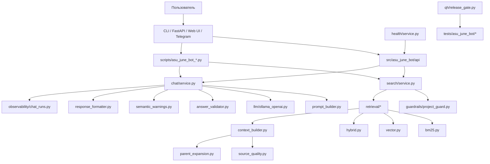
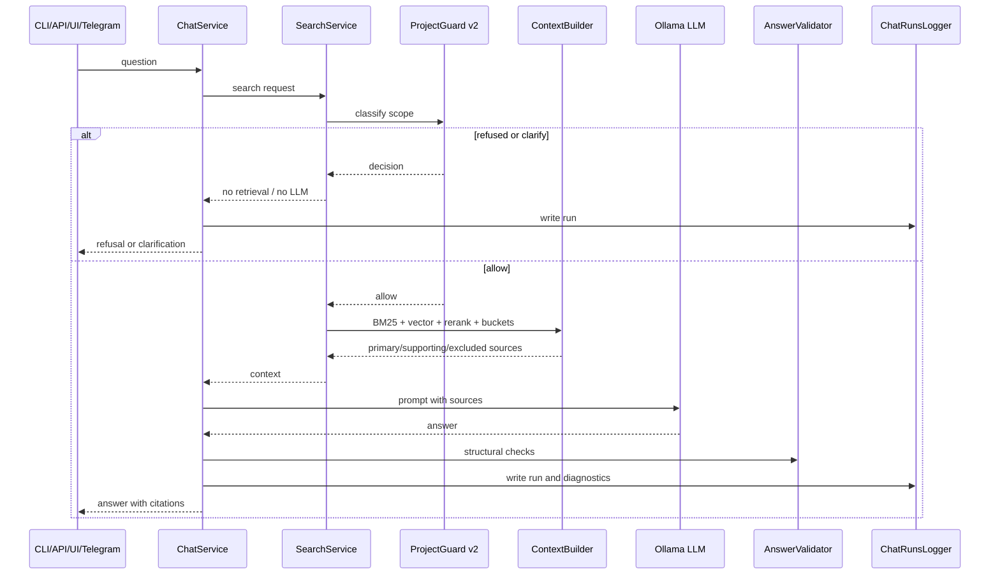
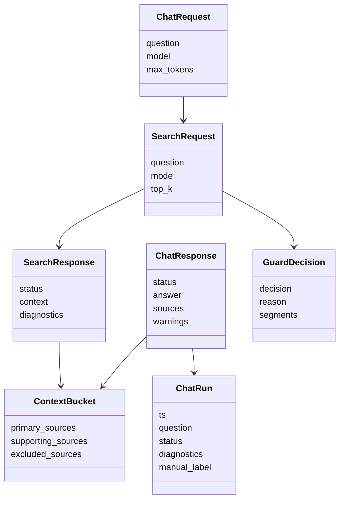
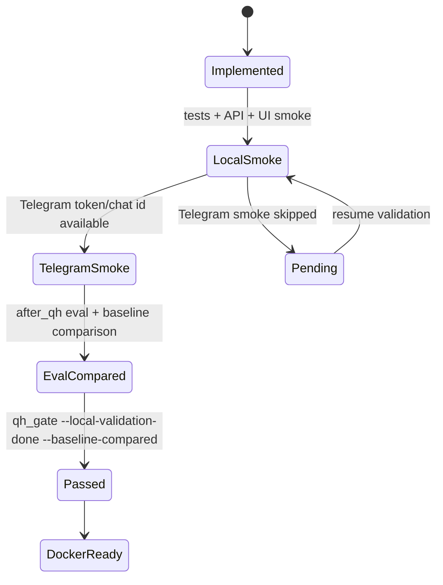
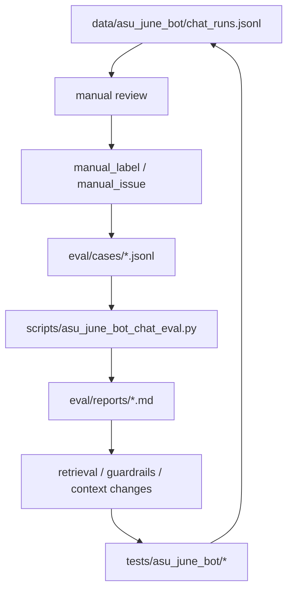

# Технические диаграммы Project Knowledge Bot

Обновлено: 2026-05-19.

## 1. Диаграмма компонентов

## 2. Диаграмма вызова `/chat`

## 3. Диаграмма технических файлов

```mermaid
flowchart LR
    Config["config.yaml / configs/asu_june_bot/*.yaml"] --> Ingest["asu_june_bot_extract_text_v2.py"]
    Ingest --> Blocks["data/asu_june_bot/extracted_v2/blocks.jsonl"]
    Blocks --> ChunksScript["asu_june_bot_build_chunks_v2.py"]
    ChunksScript --> Chunks["data/asu_june_bot/chunks_v2.jsonl"]
    Chunks --> IndexScript["asu_june_bot_build_index_v2.py"]
    IndexScript --> Cache["embeddings_cache_v2.jsonl"]
    IndexScript --> Index["numpy_index_v2/"]

    Index --> Vector["src/asu_june_bot/retrieval/vector.py"]
    Chunks --> BM25["src/asu_june_bot/retrieval/bm25.py"]
    Vector --> Hybrid["hybrid.py"]
    BM25 --> Hybrid
    Hybrid --> Search["src/asu_june_bot/search/service.py"]
    Search --> Chat["src/asu_june_bot/chat/service.py"]
    Chat --> API["src/asu_june_bot/api/app.py"]
    Chat --> CLI["scripts/asu_june_bot_chat.py"]
    API --> Telegram["scripts/asu_june_bot_telegram.py"]
```

## 4. Структурная диаграмма пакета

```mermaid
flowchart TD
    Src["src/asu_june_bot"] --> Core["core: config, limits"]
    Src --> Ingestion["ingestion: models, utils"]
    Src --> Retrieval["retrieval: chunks, bm25, vector, hybrid, context"]
    Src --> Guardrails["guardrails: segmenter, classifier, policy"]
    Src --> Search["search: request/response models, service"]
    Src --> Chat["chat: prompt, validation, formatting, warnings"]
    Src --> LLM["llm: local Ollama client"]
    Src --> API["api: FastAPI routes, errors, middleware"]
    Src --> Observability["observability: chat runs"]
    Src --> Eval["eval: cases, runner, reports"]
    Src --> QH["qh: release gate"]
    Src --> Telegram["telegram_bot.py"]
```

## 5. Объектная модель runtime

## 6. Поведенческая диаграмма QH-гейта

## 7. Quality feedback loop

## 8. Правило ответственности файлов

| Задача | Основные файлы |
| --- | --- |
| Сбор корпуса | `asu_june_bot_extract_text_v2.py`, `asu_june_bot_build_chunks_v2.py` |
| Индексация | `asu_june_bot_build_index_v2.py`, `retrieval/vector.py`, `retrieval/bm25.py` |
| Поиск | `search/service.py`, `asu_june_bot_search_v2.py`, `routes_search.py` |
| Project-only guard | `guardrails/*`, `tests/asu_june_bot/test_project_guard_v2*.py` |
| Ответ с citations | `chat/service.py`, `prompt_builder.py`, `answer_validator.py` |
| API/UI | `api/app.py`, `routes_*.py`, `routes_ui.py` |
| Telegram | `telegram_bot.py`, `scripts/asu_june_bot_telegram.py` |
| QH/eval | `eval/*`, `qh/release_gate.py`, `tests/asu_june_bot/qh/*` |
