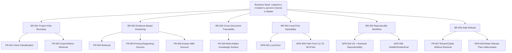

# 06. BABOK: Business Requirements

Обновлено: 2026-05-15.

## Business Need

Проекту нужен локальный проектный AI-ассистент, который сокращает стоимость ручного поиска, сверки и восстановления контекста по документации ЦП УПКС, не выходя за пределы проектных источников.

## Business Problem Statement

Сейчас знания о проекте распределены по большому числу документов и артефактов встреч. Пользователи тратят значительное время на:

- поиск нужных источников;
- сверку нескольких документов;
- проверку версий и формулировок;
- восстановление контекста после паузы;
- доказательство своих выводов ссылками на реальные материалы.

Это создает:

- задержки в аналитической работе;
- риск ошибочных интерпретаций;
- высокую зависимость от памяти конкретных людей;
- слабую воспроизводимость контекста.

## Desired Business Outcome

Создать локальный продукт, который:

- ускоряет доступ к проектным знаниям;
- делает ответы проверяемыми;
- снижает количество неподтвержденных утверждений;
- облегчает передачу контекста между участниками проекта;
- становится рабочей knowledge surface для проектной команды.

## Stakeholders

| Стейкхолдер | Интерес |
| --- | --- |
| Системный аналитик | Быстрый и проверяемый ответ по проекту |
| Архитектор | Связь архитектуры, интеграций и требований |
| ИБ-специалист | Доказуемые ответы по ИБ-аспектам |
| PM / координатор | Быстрый доступ к решениям, рискам, договоренностям |
| Тестировщик / аналитик ПМИ | Traceability требований и испытаний |
| Владелец продукта / инициатор | Снижение трения и рост управляемости проектного знания |

## Scope

В scope MVP:

- project-only retrieval по корпусу проекта;
- guard для запроса вне области;
- ответы только по источникам;
- search API;
- затем chat API;
- связь с проектными артефактами и later meeting artifacts.

Вне scope MVP:

- общий "чат обо всем";
- автономный агентный оркестратор;
- SaaS-first multi-tenant платформа;
- runtime на RAGFlow/Dify/LangGraph как обязательной базе;
- UI раньше стабильного API Search.

## Business Requirements

### BR-001. Project-Only Boundary

Продукт должен работать строго в границах проектной области ЦП УПКС.

### BR-002. Evidence-Based Answering

Продукт должен выдавать ответы, подтверждаемые проектными источниками.

### BR-003. Cross-Document Traceability

Продукт должен поддерживать связь между несколькими типами документов и артефактов проекта.

### BR-004. Local-First Operability

Продукт должен быть разворачиваемым и работоспособным локально без обязательной зависимости от внешних сервисов.

### BR-005. Reproducible Knowledge Workflow

Корпус, индекс, правила работы и документация должны быть воспроизводимы и управляемы через Git/runbook.

### BR-006. Safe Refusal

Продукт должен корректно отказывать или уточнять, если вопрос вне области, неоднозначен или не подтверждается данными.

## Functional Requirements Summary

- `FR-001` Принимать проектный запрос и классифицировать его intent.
- `FR-002` Определять, разрешено ли вообще выполнять retrieval по запросу.
- `FR-003` Искать релевантные источники по project-only корпусу.
- `FR-004` Разделять источники на primary/supporting/excluded.
- `FR-005` Возвращать diagnostics и warnings.
- `FR-006` Формировать краткий ответ с источниками.
- `FR-007` Возвращать `refused` или `clarify` без вызова retrieval, если это требуется policy.
- `FR-008` Поддерживать API `/health` и `/search`, затем `/chat`.
- `FR-009` Использовать project artifacts и в дальнейшем meeting artifacts как knowledge surface.
- `FR-010` Сохранять путь к более глубокой аналитике и traceability.

## Non-Functional Requirements Summary

- `NFR-001` Локальный запуск на рабочем ПК.
- `NFR-002` Воспроизводимость через Git и runbook.
- `NFR-003` Предсказуемая деградация: лучше отказ, чем ложный ответ.
- `NFR-004` Явное разделение runtime-артефактов и Git-артефактов.
- `NFR-005` Масштабируемость от CLI Search к API Search и Chat.
- `NFR-006` Наблюдаемость: health, smoke, eval, regression.

## Traceability

## Приоритетность По BABOK-Логике

Критичными для MVP являются:

1. граница project-only;
2. source-backed retrieval/answering;
3. safe refusal;
4. локальная воспроизводимость.

Все остальное усиливает продукт, но не должно подменять этот фундамент.
