# 06. BABOK: Business Requirements

Обновлено: 2026-05-16.

## Business Need

Проектной команде нужен локальный project-only AI-ассистент, который сокращает стоимость ручного поиска, сверки и восстановления контекста по документации информационной системы, не выходя за пределы загруженных источников.

## Business Problem Statement

Сейчас знания о проекте распределены по большому числу документов и артефактов встреч. Пользователи тратят значительное время на:

- поиск нужных источников;
- сверку нескольких документов;
- проверку версий и формулировок;
- восстановление контекста после паузы;
- доказательство своих выводов ссылками на реальные материалы;
- отделение подтвержденного факта от предположения.

Это создает:

- задержки в аналитической работе;
- риск ошибочных интерпретаций;
- высокую зависимость от памяти конкретных людей;
- слабую воспроизводимость контекста;
- недоверие к generic AI-ответам без источников.

## Desired Business Outcome

Создать локальный продукт, который:

- ускоряет доступ к проектным знаниям;
- делает ответы проверяемыми;
- снижает количество неподтвержденных утверждений;
- облегчает передачу контекста между участниками проекта;
- становится рабочей knowledge surface для проектной команды;
- позволяет измерять качество ответов через baseline cases.

## Stakeholders

| Стейкхолдер | Интерес |
| --- | --- |
| Системный аналитик | Быстрый и проверяемый ответ по проектной документации |
| Архитектор | Связь архитектуры, интеграций и требований |
| Специалист ИБ | Доказуемые ответы по ИБ-аспектам |
| Руководитель проекта / координатор | Быстрый доступ к решениям, рискам, договоренностям |
| Тестировщик / аналитик ПМИ | Traceability требований и испытаний |
| Владелец продукта / инициатор | Снижение трения и рост управляемости проектного знания |

## Scope

В scope MVP:

```text
project-only retrieval
pre-retrieval guard
answers only with sources
GET /health
POST /search
POST /chat
ChatRunsLogger
baseline eval runner
local-first runtime
```

Вне scope MVP:

```text
общий чат обо всем
автономный агентный оркестратор
SaaS-first multi-tenant платформа
RAGFlow/Dify/LangGraph как обязательная база runtime
UI раньше quality baseline
fine-tuning
semantic hard-fail без накопленного dataset
```

## Business Requirements

### BR-001. Project-only boundary

Продукт должен работать строго в границах загруженного корпуса проектной документации.

### BR-002. Evidence-based answering

Продукт должен выдавать ответы, подтверждаемые проектными источниками.

### BR-003. Cross-document traceability

Продукт должен поддерживать связь между несколькими типами документов и артефактов проекта.

### BR-004. Local-first operability

Продукт должен быть разворачиваемым и работоспособным локально без обязательной зависимости от внешних сервисов.

### BR-005. Reproducible knowledge workflow

Корпус, индекс, правила работы и документация должны быть воспроизводимы и управляемы через Git/runbook.

### BR-006. Safe refusal

Продукт должен корректно отказывать или уточнять, если вопрос вне области, неоднозначен или не подтверждается данными.

### BR-007. Observable quality

Продукт должен фиксировать chat-запуски и поддерживать baseline-оценку качества.

## Functional Requirements Summary

```text
FR-001 Принимать проектный запрос и классифицировать intent.
FR-002 Определять, разрешено ли выполнять retrieval по запросу.
FR-003 Искать релевантные источники по project-only корпусу.
FR-004 Разделять источники на primary/supporting/excluded.
FR-005 Возвращать diagnostics и warnings.
FR-006 Формировать краткий ответ с sources/citations.
FR-007 Возвращать refused/clarify без retrieval/LLM, если это требуется policy.
FR-008 Поддерживать API /health, /search, /chat.
FR-009 Использовать project artifacts и later meeting artifacts как knowledge surface.
FR-010 Сохранять путь к более глубокой аналитике и traceability.
FR-011 Логировать chat-запуски в JSONL.
FR-012 Формировать baseline eval reports.
```

## Non-Functional Requirements Summary

```text
NFR-001 Локальный запуск на рабочем ПК.
NFR-002 Воспроизводимость через Git и runbook.
NFR-003 Предсказуемая деградация: лучше отказ, чем ложный ответ.
NFR-004 Явное разделение runtime-артефактов и Git-артефактов.
NFR-005 Масштабируемость от CLI Search к API Search и Chat.
NFR-006 Наблюдаемость: health, smoke, eval, regression.
NFR-007 Локальное хранение runtime logs и отсутствие секретов в Git.
NFR-008 Подготовленность к будущей GPU/vLLM миграции через OpenAI-compatible adapter.
```

## Traceability

```mermaid
graph TD
    BN["Business Need: сократить стоимость ручного поиска и сверки"] --> BR1["BR-001 Project-only Boundary"]
    BN --> BR2["BR-002 Evidence-based Answering"]
    BN --> BR3["BR-003 Cross-document Traceability"]
    BN --> BR4["BR-004 Local-first Operability"]
    BN --> BR5["BR-005 Reproducible Workflow"]
    BN --> BR6["BR-006 Safe Refusal"]
    BN --> BR7["BR-007 Observable Quality"]

    BR1 --> FR1["FR-001 Intent Classification"]
    BR1 --> FR2["FR-002 Guard Before Retrieval"]
    BR2 --> FR3["FR-003 Retrieval"]
    BR2 --> FR4["FR-004 Primary/Supporting Sources"]
    BR2 --> FR6["FR-006 Answer With Sources"]
    BR3 --> FR9["FR-009 Multi-Artifact Knowledge Surface"]
    BR4 --> NFR1["NFR-001 Local Run"]
    BR4 --> NFR5["NFR-005 Path From CLI To API/Chat"]
    BR5 --> NFR2["NFR-002 Git + Runbook Reproducibility"]
    BR5 --> NFR7["NFR-007 Local Logs / No Secrets In Git"]
    BR6 --> FR7["FR-007 Refuse/Clarify Without Retrieval"]
    BR6 --> NFR3["NFR-003 Better Refusal Than Hallucination"]
    BR7 --> FR11["FR-011 Chat Runs JSONL"]
    BR7 --> FR12["FR-012 Eval Reports"]
    BR7 --> NFR6["NFR-006 Health/Smoke/Eval"]
```



## Приоритетность по BABOK-логике

Критичными для MVP являются:

1. граница project-only;
2. source-backed retrieval/answering;
3. safe refusal;
4. локальная воспроизводимость;
5. измеримость качества.

Все остальное усиливает продукт, но не должно подменять этот фундамент.

## Статус требований

```text
BR-001 / BR-002 / BR-004 / BR-005 / BR-006: реализованы в MVP
BR-003: частично реализовано через retrieval/context, расширяется в analyst mode
BR-007: реализовано в QH-1, ожидает локальный baseline-прогон
```
