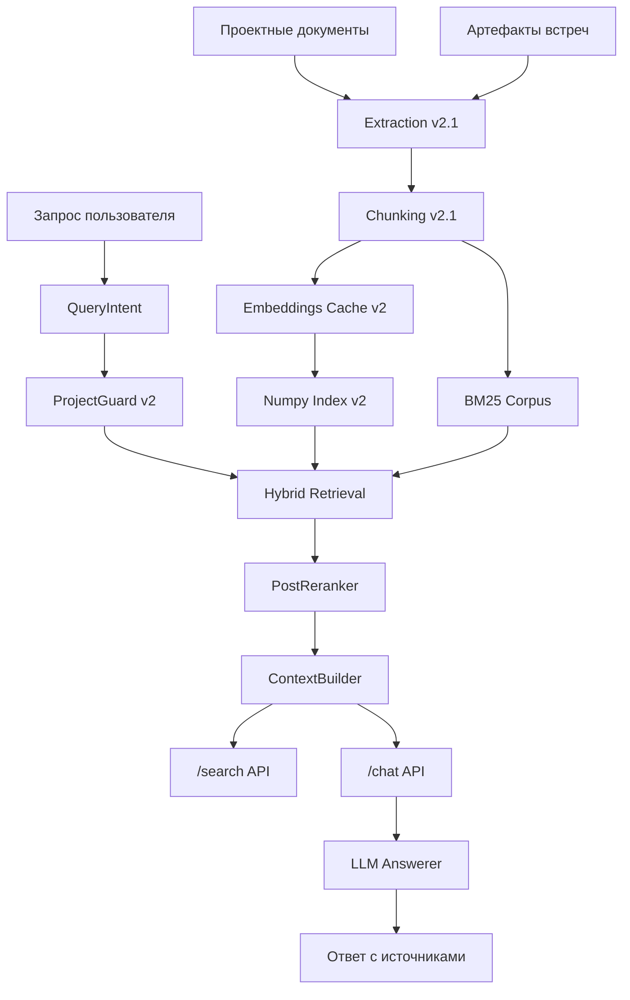
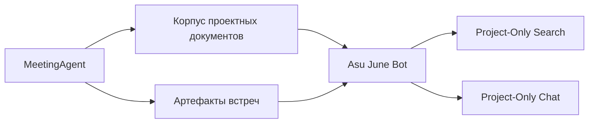
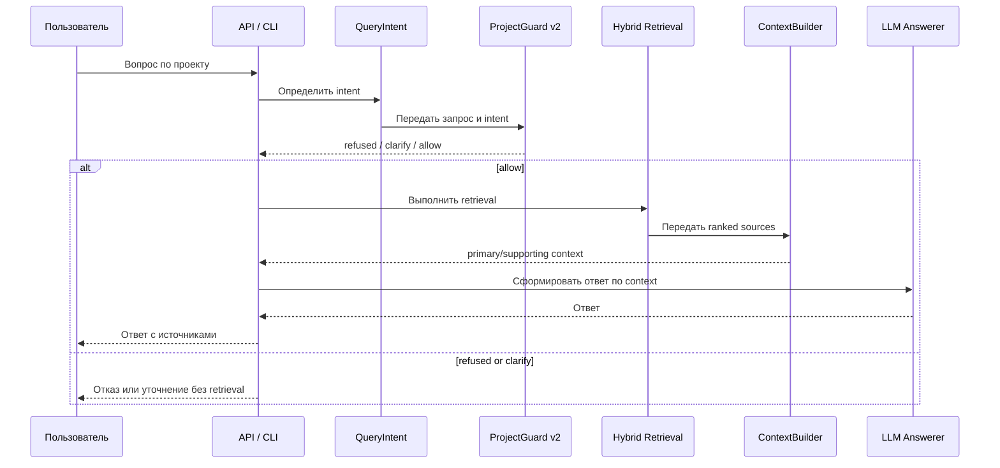
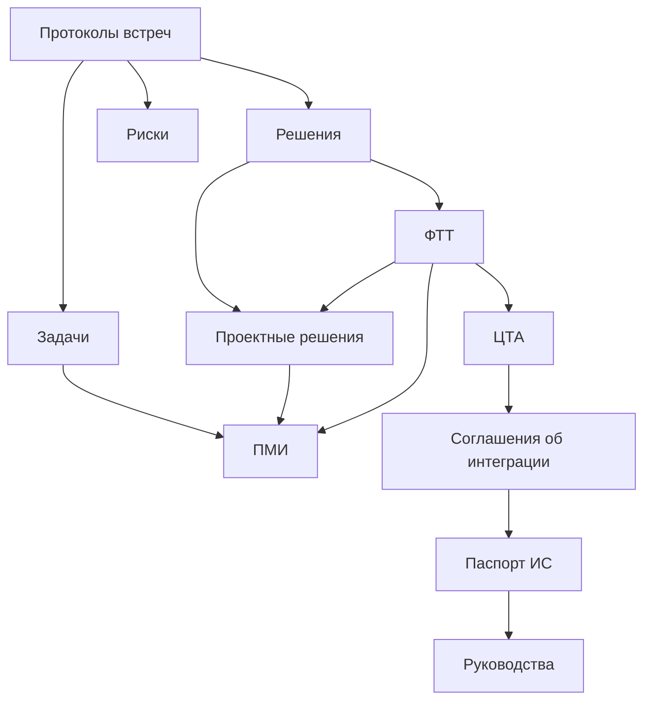
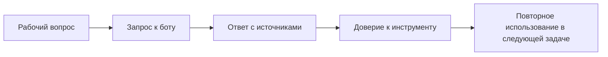

# 07. Архитектура Продукта и Взаимосвязи

Обновлено: 2026-05-15.

## Архитектура На Одной Странице

`Asu June Bot` состоит из четырех связанных слоев:

1. knowledge corpus;
2. retrieval and guard core;
3. answer surface;
4. product workflow and adoption layer.

## Общая Схема

## Взаимосвязь С MeetingAgent

Смысл разделения:

- `MeetingAgent` шире и отвечает за общий корпус, встречи и pipeline артефактов;
- `Asu June Bot` уже и отвечает за project-only knowledge interface.

## Поток Пользовательского Вопроса

## Граф Знания На Уровне Предметной Области

## Поведенческая Архитектура Использования

Это соответствует полезному продукту по `Hooked`, но без искусственной "аддиктивности". Повторяемость здесь строится на рабочей ценности.

## Архитектурные Границы

### Что Является Ядром

- corpus;
- retrieval;
- guard;
- context building;
- answer policy.

### Что Является Поверхностью

- CLI;
- API;
- будущий Open WebUI / web panel;
- отчеты и runbook.

### Что Является Расширением

- meeting integration;
- cross-document analyst mode;
- enriched traceability;
- future UI/timeline/explanations.

## Почему Такая Архитектура Правильна

Она позволяет:

- не смешивать шумный общий AI-чат с project-only продуктом;
- отдельно развивать corpus и answer surface;
- сначала стабилизировать `/search`, а потом строить `/chat`;
- позже подключить встречи, не ломая фундамент;
- держать продукт локальным и воспроизводимым.

## Ключевой Архитектурный Принцип

Интерфейс не должен быть "умнее" ядра.

Сначала должны быть стабильны:

1. corpus;
2. retrieval;
3. guard;
4. context semantics;
5. API;

и только потом chat/UI.
