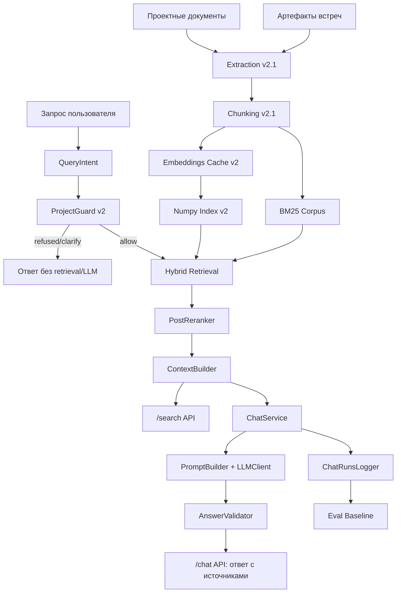
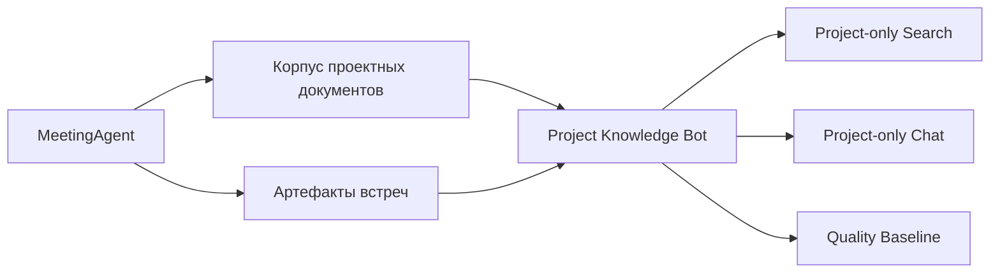
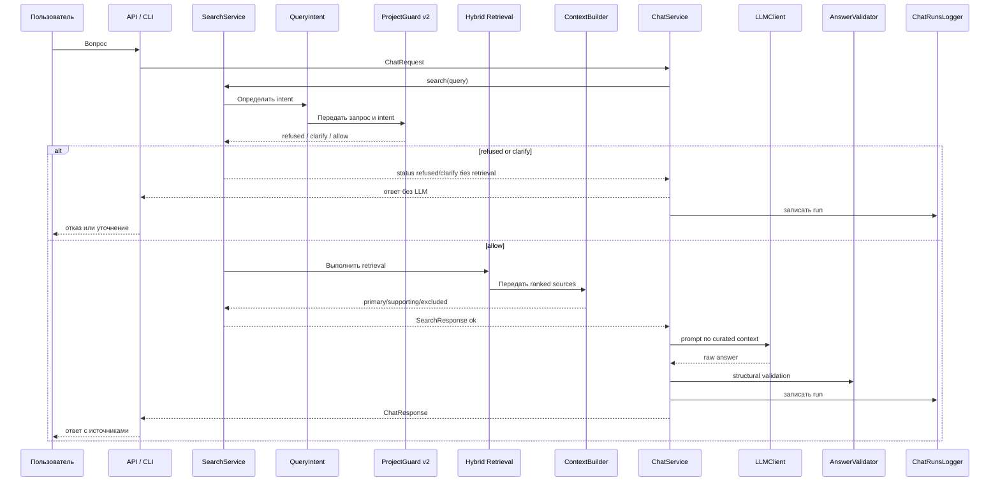
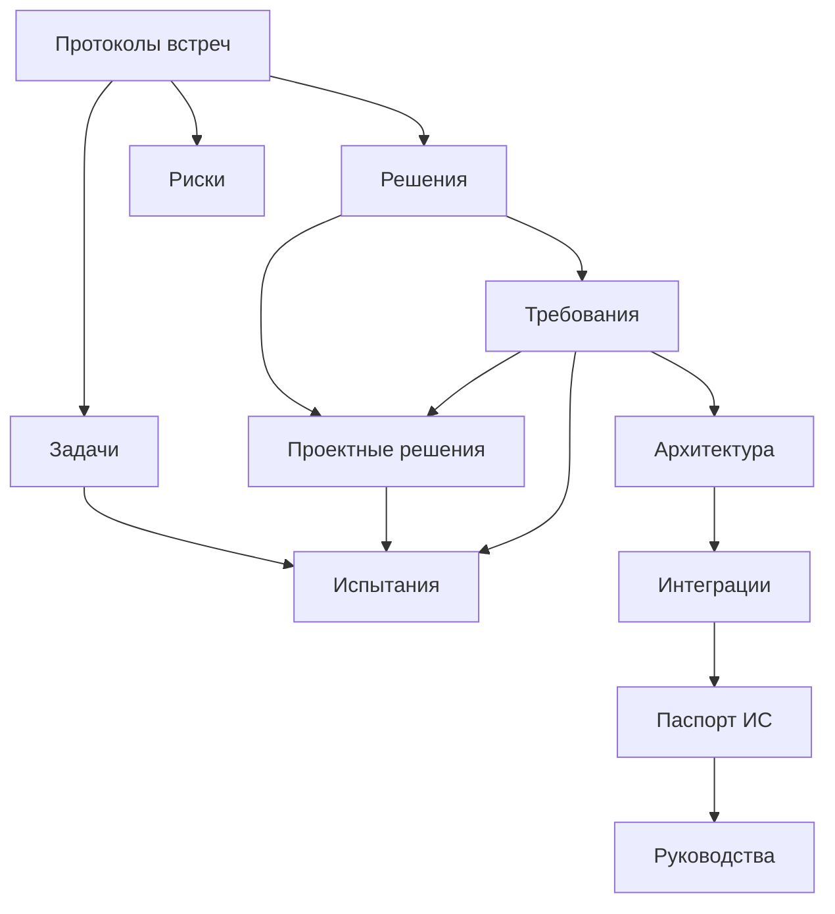
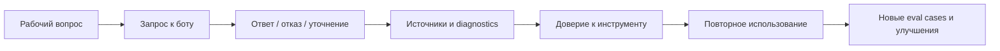

# 07. Архитектура продукта и взаимосвязи

Обновлено: 2026-05-16.

## Архитектура на одной странице

Project Knowledge Bot состоит из пяти связанных слоев:

1. knowledge corpus;
2. ingestion/chunking/index;
3. retrieval and guard core;
4. answer surface;
5. observability/evaluation layer.

## Общая схема



## Взаимосвязь с базовым репозиторием



Смысл разделения:

- базовый репозиторий шире и включает обработку встреч, транскрибацию и общий RAG baseline;
- Project Knowledge Bot уже и отвечает за project-only knowledge interface;
- при выделении в отдельный репозиторий бот должен сохранить собственные docs, runtime scripts, API, eval cases и runbook.

## Поток пользовательского вопроса



## Граф знания на уровне предметной области



## Поведенческая архитектура использования



Повторяемость строится не на искусственной вовлекаемости, а на рабочей ценности: быстрее найти, проверить и объяснить.

## Архитектурные границы

### Ядро

```text
corpus
extraction/chunking/index
retrieval
guard
context building
answer policy
validation
eval baseline
```

### Поверхность

```text
CLI
FastAPI
будущий OpenWebUI / web panel
smoke reports
runbook
```

### Расширение

```text
meeting integration
cross-document analyst mode
traceability matrix
source quality filter
parent expansion
future UI/timeline/explanations
GPU inference
```

## Почему такая архитектура правильна

Она позволяет:

- не смешивать generic AI-chat с project-only продуктом;
- отдельно развивать corpus, retrieval, chat и UI;
- сначала стабилизировать `/search`, потом `/chat`, потом UI;
- подключать встречи, не ломая фундамент;
- держать продукт локальным и воспроизводимым;
- измерять качество изменений через baseline.

## Ключевой архитектурный принцип

Интерфейс не должен быть умнее ядра.

Сначала должны быть стабильны:

1. corpus;
2. retrieval;
3. guard;
4. context semantics;
5. API;
6. chat validation;
7. eval baseline.

И только потом UI, deployment hardening и расширенная аналитика.

## Текущий статус архитектуры

```text
/search API: готов
/chat API: готов с ограничениями
observability/eval: реализованы, baseline и after_qh eval выполнены
source quality filter: реализован в QH-2
parent expansion: реализован в QH-3
```
